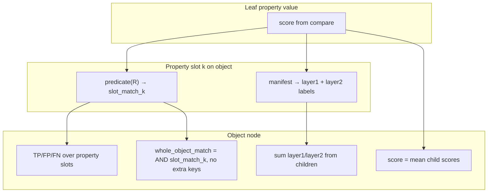
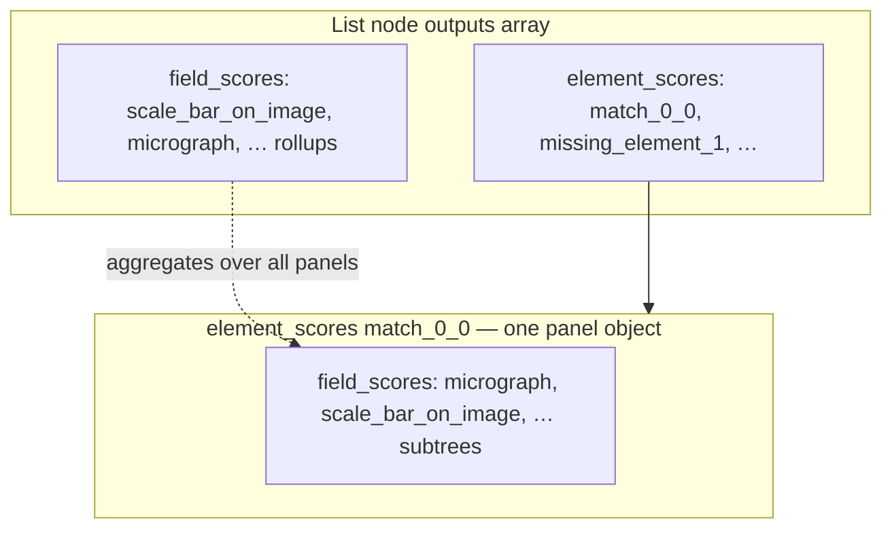

# DEPRECATED — Hierarchical scoring in schema-guided JSON comparison

> **DEPRECATED.** Do not use for new work. Normative design: [evaluation-scoring.md](evaluation-scoring.md). This file is kept for history only (`evaluation-hierarchical-scoring-DEPRECATED.md`). Manifest key `answer_metric` here is now **`matching_metric`** in the flat model.

This note described a **recursive** design for **roll-up scores**, **drill-down**, and **slot-level FP/FN** when comparing prediction JSON to gold JSON under **JSON Schema**. [Drill-down](#drill-down-field_scores-and-element_scores) used two parallel child maps — `field_scores` and `element_scores`.

## Vocabulary: slot, element, value

This wiki uses three terms consistently:


| Term         | Meaning                                                                                                                                                                                                                                                                                                                   |
| ------------ | ------------------------------------------------------------------------------------------------------------------------------------------------------------------------------------------------------------------------------------------------------------------------------------------------------------------------- |
| **Value**    | JSON content being compared: `pred[...]` vs `exp[...]`. A **leaf value** is a primitive (`string`, `number`, …) with no nested `{}` or `[]`.                                                                                                                                                                              |
| **Property** | A named key on an **object**; comparison uses **property values** at `pred[k]` and `exp[k]`.                                                                                                                                                                                                                              |
| **Element**  | One entry in a JSON **array**; comparison uses **element values** (or full subtrees when schema `items` type **X** is object or array).                                                                                                                                                                                   |
| **Slot**     | One **accounting unit** at a parent for slot `**match`** and TP/FP/FN: a **property slot** (required key `k` on an object) or an **element slot** (aligned pair, or an unmatched extra/missing row on a list). The **slot** is the parent’s bookkeeping label; the **value** (or rolled-up subtree) is what was compared. |


See also [evaluation-leaf-primitives.md](evaluation-leaf-primitives.md) for **leaf values** only.

## Why both roll-up and drill-down?

- **Roll-up at this node** — Two ideas: (1) a **roll-up score** — one quality scalar in `[0, 1]` (often **mean of child `score`s**; lists may use `max(n_pred, n_exp)` in the denominator); (2) **confusion-style summaries** — `precision`, `recall`, `f1_score` (and strict “all matched” booleans) computed from **slot counts** built using each child’s **slot `match`**, declared **at this parent** (see **Where `match` is defined** below). `std_score` summarizes spread of child scores where applicable.
- **Drill-down dictionaries** — Debugging, error messages, and per-path reporting need **where** the mismatch lives: which key, which list slot, which nested branch. Without nested structures, a single number throws away the explanation. See [Drill-down: `field_scores` and `element_scores`](#drill-down-field_scores-and-element_scores) for why there are two maps and how to read them.

So every level of the recursion ideally carries: **(1) a summary for the node** and **(2) child maps** that preserve hierarchy — keyed the way JSON Schema names (or does not name) children at that node.

**Leaves matter for roll-up:** each **primitive leaf** contributes `**score`** (and hard failures as `score = 0`). A leaf compares **property values** on objects (e.g. `pred["label"]` vs `exp["label"]`) or **element values** on lists when **X** is primitive—but in every case it only supplies `**score`**. **[Slot `match` is not a leaf responsibility](#where-match-is-defined-normative)** for **property slots** or **element slots** (nor for “did this whole nested branch succeed?”); the **object** or **list** parent decides that from the **child subtree** result (primitive or composite).

## Match vs mismatch, and how parents build TP / FP / FN and P / R / F1

### Where `match` is defined (normative)


| Slot (parent)                            | Who declares `**match`** for that slot?                                       | Rule (default)                                                                                                                                                                                                                                                                                                                           |
| ---------------------------------------- | ----------------------------------------------------------------------------- | ---------------------------------------------------------------------------------------------------------------------------------------------------------------------------------------------------------------------------------------------------------------------------------------------------------------------------------------- |
| **Object property slot** `k`             | The **object** parent, after comparing property values `pred[k]` and `exp[k]` | Build child subtree `ComparisonResult` `R`. Then `**match_k = predicate(R)`** — typically `**R.score >= τ**`, plus **FP/FN kind** for string property slots from the [free-text policy](#free-text-string-properties-fp-vs-fn-on-objects) (missing / `null` / wrong value). Primitives only supply `**R.score`**. |
| **List element slot** (aligned `i`, `j`) | The **list** parent, after subtree compare for that pair                      | `**match_el = predicate(R_{i,j})`**, default `**R_{i,j}.score >= τ**`. Works for **any** element type **X** (primitive, object, nested array) because every **X** comparison returns a rolled-up `**score`** in `[0, 1]`.                                                                                                                |


`**predicate` in full generality:** `match_slot: (child: ComparisonResult, ctx) -> bool` where `ctx` can carry schema path, slot kind, or strictness. The **threshold-only** form `score >= τ` is the minimal implementation; a richer function can require `**R.true_positive`** at the subtree root, or forbid partial object matches, etc.—but the **declaration site** stays the **parent list or parent object**, not the primitive leaf.

**Primitive leaves** ([evaluation-leaf-primitives.md](evaluation-leaf-primitives.md)) output `**score`** (graded quality and validity). They **do not** decide slot `**match`** or reporting labels; parents and a **metric profile** for the field do (see below).

At **parents** (structural roll-up, all field types):

- **Roll-up score** — aggregate child `**score`s** (e.g. mean over required fields or over `n_all` list slots). Answers “how close” even when slot `**match`** is false.
- **Structural slot TP / FP / FN** — extra keys, missing required properties, unmatched list rows (see [Objects](#objects) / [Lists](#lists)). Distinct from **applicability** / **answer** reporting below.

**Principle:** treat **JSON and JSON Schema** literally—do not collapse distinctions with Python idioms (`None`, truthiness on `""`).

## Applicability and answer metrics (reporting)

Checklist fields are not one-size-fits-all. **Reporting** should usually split into **two layers** so summary F1 is not driven by trivial **correct N/A** (`""` / `""`) pairs.

Configure per field in a separate **evaluation manifest** (see below)—**not** in the checklist `schema.json` used for OpenAI structured output.

- `**na_values`** — literals meaning **not applicable** (often `""` only).
- `**answer_metric`** — how to score when gold is applicable: `binary_polarity` | `multiclass` | `graded_string` | …
- For `binary_polarity`: `**positive_value**` (usually `"yes"`) and `**negative_value**` (usually `"no"`).

Leaves still emit `**score**` (exact enum → 0/1; fuzzy/semantic strings → graded). Parents still set slot `**match**` via `**predicate**`. The layers below are **how we aggregate** for dashboards and experiments.

### Schema contract: is N/A or yes/no unambiguous?

**No — not from JSON Schema alone.** Standard `type` + `enum` only lists allowed **literals**. It does **not** say which literal is N/A, which is “positive”, or that `"yes"` means boolean true.

**What the repo does today (examples):**


| Pattern                             | Example in repo                                                                                                                        | Ambiguity                                                                                                             |
| ----------------------------------- | -------------------------------------------------------------------------------------------------------------------------------------- | --------------------------------------------------------------------------------------------------------------------- |
| `enum: ["yes", "no"]`               | `micrograph`, `involves_replicates`                                                                                                    | No N/A in-schema; every panel must answer. Applicability is implicit (always applicable).                             |
| `enum: ["yes", "no", ""]`           | `scale_bar_on_image` in [micrograph-scale-bar/schema.json](../soda_mmqc/data/checklist/fig-checklist/micrograph-scale-bar/schema.json) | `""` **means** N/A by convention, but JSON Schema does not **declare** it — eval must configure `na_values: [""]`.    |
| `enum: ["yes", "no", "not needed"]` | `average_values` in [individual-data-points/schema.json](../soda_mmqc/data/checklist/fig-checklist/individual-data-points/schema.json) | Third value is N/A under a **different string** than `""`. Eval must list `na_values: ["not needed"]` for that field. |


**Strings vs booleans:**


| Approach                                     | Pros                                                                                      | Cons                                                                                                         |
| -------------------------------------------- | ----------------------------------------------------------------------------------------- | ------------------------------------------------------------------------------------------------------------ |
| `**type: "string"`, `enum: ["yes","no",…]`** | Matches LLM strict outputs; easy 3-state in one field (`""` or `"not needed"`).           | Polarity and N/A are **not** machine-obvious without extra metadata.                                         |
| `**type: "boolean"`**                        | `true`/`false` are unambiguous.                                                           | **No honest N/A** in a required boolean field; you need `null`, optional property, or a separate gate field. |
| **Gate + boolean**                           | e.g. required `micrograph: yes/no`, then `scale_bar_present: boolean` only when relevant. | More fields; conditional schema is harder for strict JSON mode.                                              |


**Normative recommendation:**

- Keep `**schema.json`** as the **OpenAI structured-output** contract only (`type`, `enum`, `required`, descriptions). **Do not** add custom `x-`* evaluation keys there—they are not part of that API surface and would fork schema maintenance.
- Keep **string enums** in schema for LLM outputs (`yes` / `no` / `""` / `not needed`, etc.).
- Put all evaluation semantics in a **sidecar manifest** next to each checklist (or one manifest per checklist family), keyed by **JSON paths** into the payload.

**Do not** rely on: enum order, English word shape, Python truthiness of `""`, or guessing N/A from the schema file alone.

### Evaluation manifest (sidecar)

**Location (convention):** alongside the checklist schema, e.g.  
`soda_mmqc/data/checklist/fig-checklist/<checklist-name>/eval-manifest.json`  
next to `schema.json`.

**Purpose:** map **property paths** → **metric profile** for layers 1–2. The evaluator loads `schema.json` + `eval-manifest.json` when scoring a run.

**Path keys:** JSON-pointer-style paths from the checklist output root, e.g. `outputs[].scale_bar_on_image` (one profile per leaf field; list `[]` means “each element”).

**Example (illustrative):**

```json
{
  "checklist": "micrograph-scale-bar",
  "defaults": {
    "answer_metric": "binary_polarity",
    "positive_value": "yes",
    "negative_value": "no",
    "na_values": []
  },
  "fields": {
    "outputs[].micrograph": {
      "answer_metric": "binary_polarity"
    },
    "outputs[].scale_bar_on_image": {
      "na_values": [""],
      "answer_metric": "binary_polarity"
    },
    "outputs[].scale_bar_defined_in_caption": {
      "na_values": [""],
      "answer_metric": "binary_polarity"
    },
    "outputs[].from_the_caption": {
      "answer_metric": "graded_string"
    }
  }
}
```

**Field profile keys:**


| Key                                 | Role                                                                                |
| ----------------------------------- | ----------------------------------------------------------------------------------- |
| `na_values`                         | Literals treated as **not applicable** (layer 1). Omit or `[]` = always applicable. |
| `answer_metric`                     | `binary_polarity` | `multiclass` | `graded_string`                                  |
| `positive_value` / `negative_value` | For `binary_polarity` on applicable slots (layer 2).                                |
| `match_threshold` | Optional **`τ`** for structural / answer slot `match` (graded strings). |
| `applicability_threshold` | Optional **`τ_applic`** for layer 1 (default `1` = exact N/A vs applicable agreement). |


**Defaults:** `defaults` supplies project-wide assumptions (e.g. yes/no polarity); per-field entries override only what differs (`na_values` for `""` vs `not needed` checklists).

**Validation:** manifest paths should refer to properties that exist in `schema.json`; `na_values` must be subsets of that property’s `enum` when `enum` is present. CI or a small linter can check manifest ↔ schema consistency without changing the OpenAI schema.

**Implementation:** not in repo yet; this wiki defines the contract before `JSONEvaluator` reads it.

### Layer 1 — Applicability (is this slot in scope?)

For each property or list element slot, after comparing values:


| Gold applicable? | Pred applicable? | Label                   | Meaning                                                              |
| ---------------- | ---------------- | ----------------------- | -------------------------------------------------------------------- |
| no (`na_values`) | no               | **correct_NA**          | Right to abstain (e.g. plot panel → `""`)                            |
| no               | yes              | **spurious_applicable** | Asserted yes/no (or other answer) when check does not apply          |
| yes              | no               | **withheld_applicable** | Gold required an answer; pred sent N/A (`""` or configured sentinel) |
| yes              | yes              | *(pass to layer 2)*     | Both sides in scope for content/polarity                             |


Define **applicability precision / recall / F1** on the binary event “should this slot be scored?” (gold applicable vs pred applicable). **Do not** mix **correct_NA** into the same denominator as polarity errors unless you explicitly want a “full panel” metric.

**Applicability as its own threshold (not baked into structural `match`):**

For enums, layer 1 is usually already discrete. Define an **applicability score** in `[0, 1]` per slot, e.g. `1.0` when gold/pred agree on applicable vs N/A, `0.0` on **spurious_applicable** or **withheld_applicable**. Then:

```text
applicability_match = (applicability_score >= τ_applic)
```

Default **`τ_applic = 1`** for checklist enums (hard agree on in-scope vs N/A). Lower **`τ_applic`** only if you later add soft applicability (e.g. model confidence).

**Do not** require “no **spurious_applicable**” as an extra conjunct on **`whole_object_match`** or on structural **`match_k`**: that is equivalent to folding layer 1 into structural match with **`τ_applic = 1`**, which is often **too tight** (one spurious `yes` on an N/A field would fail the whole object flag even when answer-layer errors are what you care about). Keep **structural `match_k`** on value match (`predicate(R)`, usually **`R.score >= τ`** for the full string/enum). Report applicability via **layer 1 counts / applicability F1**, not by AND-ing into structural match unless you deliberately want one strict gate.

**Lists:** run Hungarian (or positional) alignment first; classify **each aligned element slot** (and unmatched rows as structural FP/FN). Applicability is per element, not per document.

### Layer 2 — Answer (only when gold is applicable)

**Denominator:** slots where gold ∉ `na_values` (applicable-only). Trivial N/A matches never appear here.


| Field shape                              | Example                              | Primary reporting                                                                                                                                                                                 |
| ---------------------------------------- | ------------------------------------ | ------------------------------------------------------------------------------------------------------------------------------------------------------------------------------------------------- |
| **Binary polarity enum**                 | `yes` / `no` (+ `""` N/A in layer 1) | Map `yes` → positive, `no` → negative; then **TP / FP / FN / TN** on applicable slots only. `no`/`no` is **TN** (correct negative finding), not “match” only.                                     |
| **Multi-class enum (≥3 non-N/A values)** | `low` / `medium` / `high`            | No natural FP/TN — use **match / mismatch** per slot, **confusion matrix**, **macro-F1**, and **mean `score`**.                                                                                   |
| **Free-text string**                     | title, description                   | `**score`** + threshold → slot `**match**`; mean `**score**`; optional slot TP/FP/FN via [free-text policy](#free-text-string-properties-fp-vs-fn-on-objects) (missing / `null` / wrong literal). |


**Scale bar (concrete):** `enum: ["", "yes", "no"]` with `na_values = [""]`.

- Layer 1: `""`/`""` → **correct_NA**; `""`/`yes` or `""`/`no` → **spurious_applicable**; `yes`/`""` or `no`/`""` → **withheld_applicable**.
- Layer 2 (gold `yes` or `no` only): `yes`/`yes` → TP; `no`/`no` → TN; `yes`/`no` or `no`/`yes` → polarity error (FP or FN depending on which class is “positive” in config).

Full 3×3 for debugging (all nine gold×pred pairs); **headline F1** should use **applicable-only** or **weighted** counts so **correct_NA** does not dominate.

### What we are *not* doing

- One global slot TP/FP/FN for every string field without a **metric profile**.
- Treating checklist `""` as “empty wrong string” when it means **N/A** (see enum note in [evaluation-leaf-primitives.md](evaluation-leaf-primitives.md)).
- Classical document-level TN without defining the event universe.

Structural comparison (objects, lists, Hungarian) is unchanged; only **reporting** gains this split.

## Bubbling: three parallel aggregates

Do **not** fold applicability F1 and answer F1 into one opaque structural flag. At **every** node in the recursion, three aggregates roll up in parallel (children → parents the same way):

| Aggregate | What it measures | Typical roll-up | Detail |
|-----------|------------------|-----------------|--------|
| **Roll-up `score`** | How close (graded) | Mean of child `score`s (lists: `n_all` rule) | [Objects](#objects), [Lists](#lists) |
| **Structural slot counts** | Property / element slots | Sum TP, FP, FN; P, R, F1 | [Where `match` is defined](#where-match-is-defined-normative), shape sections below |
| **Manifest reporting** | Applicability + answer (layers 1–2) | Sum layer labels per manifest path | [Applicability and answer metrics](#applicability-and-answer-metrics-reporting) |



**Pipeline (every parent, abstract):**

1. **Recurse** — for each child slot (property `k` or aligned list element), `R = compare(pred, exp)`. The child may be a leaf, a [nested object](#nested-object-property-values), or a [list](#lists).
2. **Structural `match`** — the parent sets `match = predicate(R)` (default `R.score >= τ`) and increments structural TP/FP/FN. Leaves supply `score` only; parents declare `match`.
3. **Manifest (sidecar, reporting only)** — load the profile for the path; classify layer 1 (applicability) and layer 2 (answer when gold is applicable). Optional `applicability_score` + `τ_applic`. These feed **reporting aggregates only** — they **do not** replace structural `match` (do not AND “no spurious_applicable” into `predicate`; that duplicates `τ_applic = 1` on applicability alone).
4. **Drill-down** — store each `R` in `field_scores[k]` (object parent) or `element_scores[…]` (list parent). See [Drill-down](#drill-down-field_scores-and-element_scores).

Export **both** structural summaries and layer summaries so dashboards are not forced to infer one from the other.

**Implementation note:** code today implements **structural** roll-up + `true_positive` only. **Manifest layer sums** and **`τ_applic`** are not wired yet. **`whole_object_match`** stays structural (all required **`match_k`**, no extra keys). Applicability strictness belongs in **layer 1 metrics**, not as a hidden second conjunct on structural match.

### Composition example: three tracks on one enum field

The same property slot can look good on one track and bad on another. On `scale_bar_on_image` with `na_values = [""]`:

**When gold is `""` and pred is `""`:**

- **Structural:** `score = 1` → `slot_match_k` true → structural **TP**.
- **Layer 1:** **correct_NA** (do not let many of these dominate **applicability F1** if that metric is meant to be hard — use a separate denominator or report **correct_NA** rate alone).
- **Layer 2:** **skipped** (gold not applicable).

**When gold is `yes` and pred is `no`:**

- **Structural:** `slot_match_k` false → property **FP**-like at the object slot layer.
- **Layer 1:** both applicable → pass to layer 2.
- **Layer 2:** polarity **FP** or **FN** (from manifest `positive_value`).

A checklist panel can have every `""`/`""` field as **correct_NA** (layer 1) while one `yes`/`no` flip makes `whole_object_match` false via structural `slot_match` — the tracks are independent by design.

---

## Three structural shapes

The dispatcher looks at JSON Schema `type` (and `required`, `items`, etc.) at the current path. Three shapes matter for drill-down and roll-up:

| Shape | Meaning | Roll-up / drill-down |
|-------|---------|----------------------|
| **Object** | JSON object with named properties | [Objects](#objects); drill-down via `field_scores` (property names) |
| **List of X** | Array whose `items` schema describes element type **X** | [Lists](#lists); drill-down via `element_scores` (alignment keys); **X is not “scalar only”** |
| **List of objects** | **X** is `object` | [Lists](#lists) + [`element_scores` and `field_scores` together](#list-of-objects-two-questions-two-dicts) |

**What is X?** Whatever `items` declares: primitives (`string`, `number`, …), `object`, or `array` (nested lists). Recursion uses the same machinery at each depth.

---

## Objects

### Required properties as slots

**Unit of accounting:** each **required schema property** is one slot. Extra keys in the prediction (not in the gold schema’s required set for that object) are **FP**-like; a required property that gold requires but pred does not satisfy is **FN**-like.

For each required key `k`, compare `pred[k]` to `exp[k]` to get child `R`. The parent computes **`match_k = predicate(R)`** and applies structural FP/FN rules ([free-text table](#free-text-string-properties-fp-vs-fn-on-objects) when the value is a string; [nested object rules](#nested-object-property-values) when the value is an object). With a manifest, also attach layer 1/2 labels for reporting on that path. Store `R` in `field_scores[k]`.

At the **object** node (non-empty required set):

- **`score`** — mean of child scores (missing keys → 0).
- **Precision / recall / F1** — from **structural** property-slot TP, FP, FN (extra keys increase FP).
- **`whole_object_match`** — strict all-or-nothing flag:

```text
whole_object_match =
  (∀ k in required: slot_match_k)
  ∧ (no extra keys in pred)
```

Same idea as today’s `ComparisonResult.true_positive` on objects in [`evaluation.py`](../soda_mmqc/core/evaluation.py). **Stricter than object P/R:** precision can be `1.0` with one FN if denominators count slots differently. **Independent of applicability/answer F1** (see [composition example](#composition-example-three-tracks-on-one-enum-field)).

### Nested object property values

**When it applies:** a required property `k` has schema `type: object` (or a sub-schema with `properties`). The parent compares `pred[k]` and `exp[k]` as **whole subtrees**.

**Unit of accounting at the parent:** property `k` is still **one slot**. The nested object’s required properties are slots **inside** child `R`, not on the grandparent.

**Pipeline:**

1. `R = compare(pred[k], exp[k])` — full [object](#required-properties-as-slots) machinery runs inside the child (and deeper if needed).
2. Parent sets **`match_k = predicate(R)`** — default **`R.score >= τ`** (mean of nested field scores). Alternative: **`predicate(R) = R.whole_object_match`** when the product wants property `k` to pass only if the inner object is perfect.
3. **Parent slot FP/FN:** if pred **supplies** a JSON object for `k` but `match_k` is false → **FP** on the parent (precision failure). If the key is **absent** or `null` when the schema disallows it → **FN** (same recall story as [string slots](#free-text-string-properties-fp-vs-fn-on-objects)). **Do not** promote inner field FP/FN to the parent’s slot counters — the parent asks whether the **nested branch** succeeded as a unit.
4. **Drill-down:** `field_scores[k]` holds the full nested `ComparisonResult` (inner `field_scores`, inner P/R/F1, inner `whole_object_match`).
5. **Manifest:** layer 1/2 labels attach to leaf paths under `k`; the parent **sums** descendant counts from `R.field_scores` for reporting roll-ups.

**Roll-up score:** the parent object `score` treats `R.score` like any other property (mean over required keys).

**Toy — parent with nested `metadata` object**

- Gold: `{ "id": 1, "metadata": { "author": "Ada", "year": 1843 } }`
- Pred: `{ "id": 1, "metadata": { "author": "Ada", "year": 1900 } }`
- Inner: `author` TP, `year` FP → inner `whole_object_match` false, inner `score` < 1.
- Parent: `id` → TP; `metadata` → one property slot **FP**. Parent `whole_object_match` false. Drill-down in `field_scores["metadata"]` shows which inner field failed.

**Contrast with [lists](#lists):** the same JSON shape under a **property** is one **property slot** on the parent object. As an element of `outputs[]` it is an **element slot** on the list parent — same subtree `R`, different parent bookkeeping ([list of objects](#when-x-is-an-object-or-nested-array)).

### Free-text string properties: FP vs FN on objects

**Scope:** ordinary **content** strings (titles, labels, free text). **Not** checklist enums where `""` ∈ `na_values` — use [applicability and answer metrics](#applicability-and-answer-metrics-reporting) instead.

**Definitions (normative for this wiki):**

- **FN (false negative on this slot)** — Gold’s requirement for this property is a **conforming value that pred never supplies** in JSON terms: the key is **absent**, or the value is JSON `**null`** while the schema for this property is **string-only** (type does **not** include `null`). Interpretation: *recall failure* — “we needed a string here and did not get one.”
- **FP (false positive on this slot)** — Pred **does** supply a JSON value for the property, but the **object parent** does **not** mark the slot `**match`** (wrong text, `**predicate**` false on the child subtree—e.g. `**score < τ**`—outside `enum`, **or** empty string `""` when gold expects a non-empty string / when `minLength` and leaf logic yield a failing `**score`**). Interpretation: *precision failure* — “something was asserted for this key, but it is wrong or inadmissible.”

**Why `""` is FP, not FN (JSON-native argument):**

In JSON, `""` is a **string value that exists**. It is neither “key missing” nor `null`. Calling it **FN** would conflate three distinct gold–pred situations that the wire format keeps separate. **FP** keeps the invariant: **FN only when no conforming literal was provided**; `**""` is a literal (length 0)** → if the parent’s `**predicate*`* is false (e.g. low `**score**` vs gold), that is pred’s **wrong submission**, same class as `"bad"`. Use `**minLength: 1`** in the schema when the product forbids empty strings; the leaf reflects failure in `**score**`; the parent still classifies the slot as **FP**, consistent with other non-matching strings.

**Why JSON `null` is FN (when `type` is `"string"` only):**

If gold has a string and the schema does not admit `null`, `**"label": null`** means pred did not deliver a string at all—it is **not** the empty string and **not** a missing key, but in evaluation terms it is **“no string answer”** alongside absence. Classifying as **FN** aligns **missing key**, `**null`**, and (if you ever need it) other **non-string** typed values for a string slot under the same *recall* story. If the schema is explicitly `["string", "null"]` and gold is `null`, then `**null` vs `null`** is a normal leaf comparison; the **object parent** marks the slot `**match`** when `**predicate**` holds on the child result (typically high `**score**` for both null).

**Summary table (string slot, gold expects a concrete string like `"ok"`):**


| Pred JSON for `label`                    | Slot classification                        | One-line reason                                                                                                         |
| ---------------------------------------- | ------------------------------------------ | ----------------------------------------------------------------------------------------------------------------------- |
| Key **absent**                           | **FN**                                     | No property in pred object — nothing to compare to gold’s string.                                                       |
| `**null`** and schema is **string-only** | **FN**                                     | No string value delivered (JSON null ≠ string).                                                                         |
| `**""`**                                 | **FP**                                     | A string was delivered; the parent does not mark **match** vs gold / schema (unless gold is `""` and schema allows it). |
| `**"bad"`** (non-matching)               | **FP**                                     | Wrong asserted string.                                                                                                  |
| **Extra key** (e.g. `noise`)             | **FP** (separate slot or extra-field rule) | Assertion outside gold’s allowed shape for that object.                                                                 |


**JSON Schema as contract:** `required`, `type` (including union with `"null"`), `minLength`, `enum`, and `pattern` define how the **leaf `score`** is formed; the **object parent** then combines `**score`**, `**predicate**`, and this table to label **FP vs FN** and whether the property `**match`**es.

**Do not use** Python `if not value:` across JSON forms—that erases the `**""` vs `null` vs missing** distinction JSON was designed to preserve.

**Toy — object with two required fields (wrong string on `label`)**

- Gold: `{ "id": 1, "label": "ok" }`  
- Pred: `{ "id": 1, "label": "bad" }`  
- `id` **matches** → **one TP** slot. `label` **does not match** (wrong string) → **one FP** slot, **not** FN.

Slot totals: `**TP = 1`, `FP = 1`, `FN = 0`** → precision `1/2`, recall `1`. A strict “whole object matched” flag would be **false** (not every property matched; no extra keys).

**Toy — extra key**

- Gold: `{ "id": 1 }`, Pred: `{ "id": 1, "noise": true }`  
- One **FP** slot from `noise`, so object precision drops; object `true_positive` is false.

## Lists

**Unit of accounting:** **list elements after alignment**, not raw indices. At any list node, **TP / FP / FN always describe list *elements*** (whole items), never individual fields inside those items. Inner fields and inner lists have their own TP/FP/FN inside each element’s nested `ComparisonResult`.

### Element slots and alignment

1. For every candidate pair `(pred_i, exp_j)`, run the **full subtree comparison** for element type **X** and read rolled-up subtree `score` in `[0, 1]` (primitives, [nested objects](#nested-object-property-values), or inner lists all produce a score).
2. **Align** on those scores (e.g. Hungarian to maximize total similarity).
3. For each aligned pair, the **list parent** sets **`match_el = predicate(R_{i,j})`** — default **`R_{i,j}.score >= τ`**. Alternative: subtree **`whole_object_match`** when an element must be a “perfect panel.”
4. Pairs **below threshold** do not count as `TP_el`; those rows become **unmatched** → pred-only rows are **FP elements**, gold-only rows are **FN elements**.

Let `TP_el` = matched pairs above threshold, `FP_el` = extra predicted elements, `FN_el` = missing expected elements. The implementation uses `n_all = max(len(pred), len(exp))` when averaging **scores** (including zero-score stubs for missing/extra).

- **List precision** ≈ `TP_el / (TP_el + FP_el)`
- **List recall** ≈ `TP_el / (TP_el + FN_el)`
- **List F1** from precision and recall as usual.

**Why not propagate inner TP/FP/FN to the list row?** The list layer answers **“which items aligned?”** (set-style). Inner metrics live in `element_scores["match_i_j"].field_scores` (objects) or deeper `element_scores` (arrays). See [drill-down](#drill-down-field_scores-and-element_scores).

**Checklist root:** top-level `outputs` → list metrics; each panel object → [object metrics](#objects) + summed manifest counts from per-field profiles under `outputs[].<field>`.

### When X is a primitive

No list-level `field_scores` rollup — only `element_scores` with [synthetic alignment keys](#element_scores--break-down-by-list-slot).

**Toy — list of strings, exact match threshold 1.0**

- Gold: `["a", "b"]`, Pred: `["a", "b", "x"]`  
- Alignment: two pairs match; `x` is **extra** → `TP_el = 2`, `FP_el = 1`, `FN_el = 0` → precision `2/3`, recall `1`.

**Toy — same length, one substituted value (`x` vs `c`)**

- Gold: `["a", "b", "c"]`, Pred: `["a", "b", "x"]`  
- Hungarian assigns `(0,0)`, `(1,1)`, `(2,2)`. First two pairs score `1.0`; `"x"` vs `"c"` scores `0.0` (below threshold).

The pair below threshold does **not** count toward `TP_el`. Pred index `2` → **one FP element**; gold index `2` → **one FN element**. Both labels apply at the element-slot layer — one failed alignment charges one pred row and one gold row, not the same atom twice.

With `TP_el = 2`, `FP_el = 1`, `FN_el = 1`: precision and recall both `2/3`.

**Toy — one wrong value (sub-threshold pair)**

- Gold: `["a"]`, Pred: `["z"]`  
- Hungarian assigns the pair; similarity below `match_threshold` → element-level FP/FN drive list precision/recall.

### When X is an object or nested array

Element-slot `match` uses the same `predicate(R)` rule as primitives — one decision per **whole element** subtree.

**List of objects (`X` = `object`):**

- **Element layer** — each matched item carries a full [object](#objects) subtree (`field_scores` per property, object-level P/R/F1 inside that subtree).
- **Cross-list field rollups** — additionally, for each required object field name `f`, the **second** `field_scores` block on the **list** node aggregates how `f` behaved over all alignments: matched items contribute that field’s subtree; each **extra** pred row adds **FP** for every `f`; each **missing** gold row adds **FN** for every `f`. That yields another P/R/F1 per `f` in `field_scores[f]` — a different question from element-layer P/R (“how did field `title` behave across the whole checklist?”).

**List of arrays (`X` = `array`):**

- **No** list-level `field_scores` rollup. Drill-down is `element_scores` only; each slot holds a nested list’s own `ComparisonResult`.
- **Outer** TP/FP/FN = which inner lists matched as wholes; **inner** TP/FP/FN = quality inside each inner list.

**Toy — list of two small objects (one wrong field inside one item)**

- Gold: `[ { "id": 1, "t": "a" }, { "id": 2, "t": "b" } ]`  
- Pred: `[ { "id": 1, "t": "a" }, { "id": 2, "t": "wrong" } ]`

After alignment, the second item’s subtree score is below threshold → **one FP element** and **one FN element** at the list layer (same pattern as `"x"` vs `"c"`). Inside the second item’s drill-down, object-internal FP/FN show which field failed (`t`).

**Toy — list of lists**

- Gold: `[ [1,2], [3] ]`, Pred: `[ [1,2], [9] ]`  
- Outer list: if `[3]` vs `[9]` fails threshold, same FP/FN element pattern at the outer slot level. Inner `[1,2]` vs `[1,2]` has its own `TP_el` inside the nested result.

**Toy — list of `{ "id": integer }`, one missing item**

- Gold: `[ { "id": 1 }, { "id": 2 } ]`, Pred: `[ { "id": 1 } ]`  
- Element-level **FN**; list recall < 1. Field `id` rollup reflects one matched `id` and one missing row’s **FN** contribution.

On a **list-of-objects** node, **precision / recall** can mean **element-layer** metrics **or** `field_scores[f]` rollups — always check which subtree you are reading.

---

## Accuracy

**Accuracy** depends on which layer and field profile you mean. **Applicable-only** accuracy for a `yes`/`no` field can use (TP + TN) / (applicable slots). **Full-panel** accuracy that counts **correct_NA** needs its own denominator and label — do not merge with polarity F1 without an explicit definition.

## Drill-down: `field_scores` and `element_scores`

Roll-up answers **how good** a node is. Drill-down answers **where** the comparison went wrong (or right) inside that node. Without child maps, a single `score` or F1 is not actionable — you cannot build error messages, per-field dashboards, or “open this panel and see which property failed.”

The design problem: **objects and lists do not name their children the same way in JSON Schema.**

| Parent shape | How schema identifies children | Natural drill-down key |
|--------------|-------------------------------|------------------------|
| **Object** | `properties` + `required` → **property names** (`title`, `scale_bar_on_image`, …) | The JSON key string |
| **Array** | `items` describes element **type**, not slot names or stable IDs | An **alignment event** (which pred index paired with which gold index, or extra/missing row) |

One generic `children: dict` would either force fake property names onto list slots or lose the cross-list field question (below). Hence **two** dict fields on every `ComparisonResult`, each reserved for one key namespace. At any given node, **one dict is filled and the other is empty** — except list-of-objects, which uses both for **different questions**.

### `field_scores` — break down by **property name**

**When the parent is an object**, each required (or extra) property `k` gets one entry:

```text
field_scores[k] → ComparisonResult for compare(pred[k], exp[k])
```

Keys are **real schema property names** — the same strings you see in JSON and in the evaluation manifest (`outputs[].scale_bar_on_image`). Values are **full subtrees** (leaves, nested objects, or lists), not just a float.

**On a list parent:** `field_scores` is **empty** unless `items` is `object`. Then it holds a **second** kind of entry (see [list-of-objects](#list-of-objects-two-questions-two-dicts) below) — not per-list-slot keys.

**On leaves:** both dicts are empty; the node only has `score`.

### `element_scores` — break down by **list slot**

**When the parent is a list**, each alignment outcome gets one entry:

```text
element_scores[alignment_key] → ComparisonResult for that whole element subtree
```

Keys are **synthetic** because arrays have no named slots in schema — only order and value. After Hungarian (or positional) matching, keys encode the **alignment event**:

| Key pattern | Meaning |
|-------------|---------|
| `match_{pred_idx}_{exp_idx}` | Prediction index `pred_idx` paired with expected index `exp_idx` and above threshold |
| `unexpected_element_{pred_idx}` | Extra predicted row (unmatched or sub-threshold pred side) |
| `missing_element_{exp_idx}` | Missing expected row (unmatched or sub-threshold gold side) |

Example: `match_0_2` means “prediction index 0 was paired with expected index 2.”

**On an object parent:** `element_scores` is always empty. Objects do not have element slots.

### List-of-objects: two questions, two dicts

Checklist `outputs[]` is the motivating case. A list-of-objects node must answer **two unrelated questions**:

| Question | Layer | Dict | What you get |
|----------|-------|------|--------------|
| **Which panels aligned as wholes?** | Element | `element_scores` | One subtree per aligned/extra/missing **row** (`match_0_0` → whole panel object) |
| **How did field `f` behave across all panels?** | Cross-list rollup | `field_scores` on the **list** node | Aggregated P/R/F1 and mean score for property name `f` over every alignment |

These are not duplicates. Element-layer metrics can be perfect (two panels matched) while `field_scores["scale_bar_on_image"]` on the list node shows poor recall because one panel’s inner field failed — and vice versa.

**Per-panel, per-field detail** lives one level deeper:

```text
element_scores["match_0_0"].field_scores["scale_bar_on_image"]
```

That path is the manifest path `outputs[].scale_bar_on_image` instantiated for panel 0. The list-level `field_scores["scale_bar_on_image"]` is the **aggregate across all panels** — the metric you want for “how often did the model get scale bars right on micrographs?” without re-walking every `match_*` entry.



### Walkthrough — nested path in a result tree

Typical drill-down path in [`evaluation.py`](../soda_mmqc/core/evaluation.py) output (simplified):

```text
root.element_scores["match_0_0"]                    # list: which panel
  .field_scores["scale_bar_on_image"]             # object: which property on that panel
    .score                                         # leaf roll-up
```

If `sections_as_in_manuscript` is itself a list on the panel object:

```text
…field_scores["sections_as_in_manuscript"]
  .element_scores["match_0_0"]                     # inner list alignment
    .field_scores["name"]                          # property on section object
```

The pattern repeats at every depth: **object → `field_scores` (property names); list → `element_scores` (alignment keys)**. Nested objects use `field_scores` at each object layer; nested lists use `element_scores` at each list layer.

### Implementation note: one dataclass, overloaded `field_scores`

The repo uses a **single** `ComparisonResult` type everywhere ([`evaluation.py`](../soda_mmqc/core/evaluation.py)) so JSON serialization stays uniform. That forces both dicts onto every node even when one is always `{}`.

**The naming trap:** `field_scores` means:

1. **Under an object** — per-property **subtrees** (keys = property names).
2. **Under a list-of-objects** — per-property **cross-list rollups** (keys = same property names, values = aggregates, not another alignment layer).

So “open `field_scores`” is ambiguous until you know the **parent node type**. `element_scores` is less ambiguous — it is only meaningful under lists.

Alternatives for a future refactor: discriminated breakdown types (`ObjectBreakdown` vs `ListBreakdown`), or rename list rollups to `list_item_field_rollups`. Behavior in this wiki is the contract; naming may change when the type is split.

## How this should guide implementation

For **schema-guided** recursive comparison:

1. **Every recursive node** should be able to expose a **roll-up** so parents can aggregate (mean, counts, Hungarian cost, etc.).
2. **Every non-leaf node** should be able to expose **drill-down** keyed in a way that matches **object vs list** semantics—not only generic “children.”
3. **List-of-objects** is the only shape that needs **both** dicts at once: `element_scores` for per-alignment subtrees and `field_scores` for cross-list field rollups — see [list-of-objects: two questions](#list-of-objects-two-questions-two-dicts).
4. **Object string slots** should implement the **adopted FP/FN policy** above (JSON `""` vs `null` vs missing key)—refactors should converge code to this contract.

When we refactor toward a package layout (e.g. schema-driven **leaves**, **compare_lists** / **compare_objects**, and a clearer **ComparisonResult**), this page is the **normative contract** for behavior and naming. Legacy code may still differ until aligned.

## See also

- [Evaluation scoring](evaluation-scoring.md) — normative design (use this).
- [Toy examples](evaluation-toy-examples.md) — worked gold/pred cases (flat leaf model).
- [Leaf primitives (strings, numbers, booleans)](evaluation-leaf-primitives.md) — how terminal / non-structured values are compared schema-first.
- [evaluation-json-vs-open-source.md](evaluation-json-vs-open-source.md) — why this comparator is custom vs OSS frameworks.
- [README.md](README.md) — wiki conventions.

