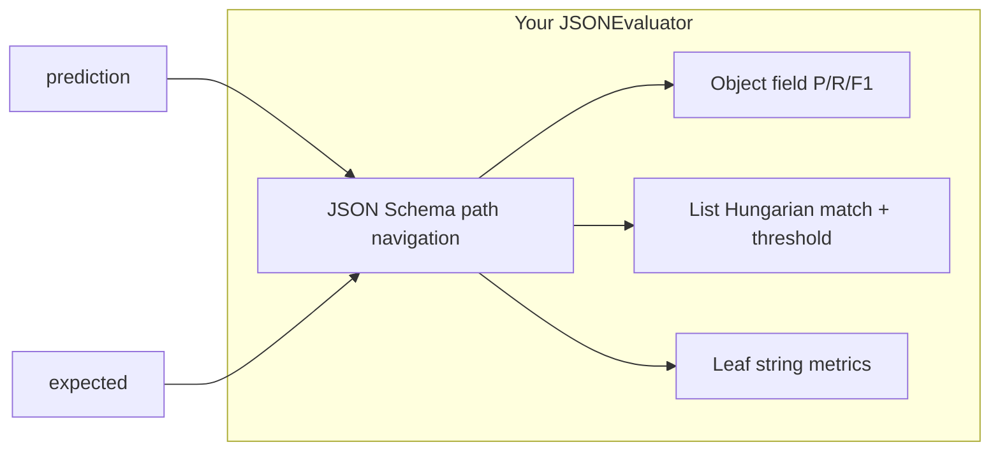

# Reflection: custom hierarchical JSON evaluation vs open source

**Wiki:** catalog [`index.md`](index.md); conventions [`README.md`](README.md).

Analysis of [`JSONEvaluator`](../soda_mmqc/core/evaluation.py) in [`soda_mmqc/core/evaluation.py`](../soda_mmqc/core/evaluation.py) against open-source evaluation frameworks: what you built is unusually specific; most tools cover orchestration, exact JSON, or LLM judges—not a full drop-in replacement.

## What your code actually does (relevant to “replace or not”)

`JSONEvaluator` is **not** a generic “diff two JSON trees” utility. It is a **schema-driven** comparator tied to your checklist shape (e.g. `evaluate()` branches on `outputs` under `schema["format"]["schema"]`).

**Design characteristics that matter for framework fit:**

- **Leaves as strings** (plus enum validation on strings): comparators are pluggable—exact, LCS-based fuzzy (`lcs_ratio`), or `SentenceTransformer` cosine similarity, all gated by `match_threshold`.
- **Objects**: walk **required** keys from the schema; extra keys → false positives; missing → false negatives; roll up **precision / recall / F1** and a boolean “all fields matched” style `true_positive` at the object level; nested `field_scores` preserve hierarchy.
- **Lists**: build an **all-pairs similarity matrix** of element comparisons, then **`scipy.optimize.linear_sum_assignment`** on **negated** scores for **maximum-weight bipartite matching** (Hungarian). Pairs below threshold do not count as matches; leftovers are FP/FN. For object items, you **aggregate per-field** stats across matched elements—this is domain logic, not a standard library primitive.
- **Output model**: `ComparisonResult` with `to_dict()` recursively serializes nested scores and confusion-style flags at multiple levels.

So you have three layers at once: **(1)** structured prediction shape, **(2)** fuzzy/semantic **leaf** scoring, **(3)** **set-like list alignment** plus **hierarchical metrics**. That triple is why “one framework replaces it all” is unlikely.

---

## Inspect.ai (and similar “eval harness” frameworks)

**[Inspect AI](https://inspect.ai-safety-institute.org.uk/)** (UKGovernmentBEIS / AISI) is primarily an **evaluation harness**: tasks, models, sampling, **scorers**, structured output for **generation**, parallel runs, and reporting. It does **not** ship a built-in equivalent of your schema-guided fuzzy list-matcher with hierarchical TP/FP/FN trees.

**Fit:** Use Inspect (or similar) as the **runner and experiment layer**, and keep your comparison logic as a **custom scorer** or post-step. Same pattern applies to **Langfuse**, **Braintrust**, **Weights & Biases Evals**, **Arize Phoenix / OpenInference**: they excel at **traces, datasets, dashboards, CI**—not this specific metric definition.

---

## Frameworks that touch JSON / structure (and gaps vs your code)

| Area | Examples | Overlap with your module | Typical gap |
|------|-----------|---------------------------|-------------|
| **Exact / schema JSON** | DeepEval `JsonCorrectnessMetric` (Pydantic/schema validation), OpenAI Evals `json_match` | Structure and validity | No fuzzy/semantic leaves; no Hungarian list alignment; no your exact hierarchical P/R/F1 rollup |
| **LLM-as-judge** | Inspect scorers, DeepEval G-Eval, OpenAI model-graded evals | Flexible “is this good enough?” | Non-deterministic, cost/latency; different semantics from embedding/LCS at each node |
| **RAG / QA metrics** | Ragas, etc. | Text similarity notions | Not nested checklist JSON with set-valued lists |
| **Structural diff** | `jsondiff`, various schema diff tools | Tree comparison | Usually exact or path-based; not thresholded semantic similarity + optimal matching |

**DeepJSONEval** (research/benchmark around nested JSON) is about **benchmarking** complex JSON generation, not a drop-in replacement library for your scorer.

---

## Direct answer to your question

- **Is there an existing OSS framework that fully replaces this script?** **Not in one box.** The **Hungarian alignment + per-threshold TP + nested field aggregation + three leaf metrics + schema-path coupling** is a **custom evaluation spec**. General tools either do **exact** JSON comparison, **validation**, **LLM judging**, or **orchestration**—rarely all of your list semantics and hierarchical confusion accounting together.
- **Could Inspect.ai (or peers) still help?** **Yes, as infrastructure**: standardized eval runs, model/provider abstraction, and a thin wrapper that calls `JSONEvaluator.evaluate(...)`. Your **core value** stays in the comparator (or a small extracted package) unless you deliberately simplify the metric (e.g. move to LLM-judge-only or exact JSON).

---

## If you ever *did* want to reduce custom code (conceptual directions, not a mandate)

1. **Keep the comparator, adopt a harness** (Inspect / Langfuse / Braintrust): lowest risk; clearest separation of concerns.
2. **Swap leaf metrics** for maintained libs (e.g. rapidfuzz for edit-distance-style fuzzy) while **keeping** assignment + hierarchy—medium refactor, same architecture.
3. **Replace parts with LLM-as-judge** for open-ended fields: higher flexibility, loses determinism and the current fine-grained hierarchy unless you prompt for structured judge output (new complexity).

---

## See also

- [Evaluation scoring](evaluation-scoring.md) — normative flat leaf model. Legacy: [evaluation-hierarchical-scoring-DEPRECATED.md](evaluation-hierarchical-scoring-DEPRECATED.md).
- [Leaf primitives](evaluation-leaf-primitives.md) — terminal JSON values (strings, numbers, booleans) and schema-driven comparison.

## Summary

[`evaluation.py`](../soda_mmqc/core/evaluation.py) is closer to a **domain-specific scoring engine** than to something Inspect or DeepEval ships out of the box. **Open-source eval frameworks complement it** (runs, models, dashboards, optional judges); they **do not obsolete** the Hungarian list matching + hierarchical schema-aware metrics without reimplementing that logic as a custom scorer anyway.
