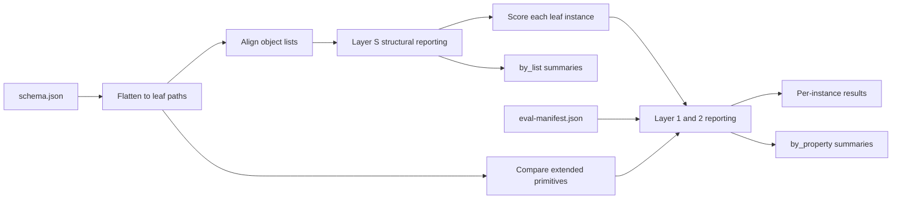

# Evaluation scoring (flat leaf model)

Normative design for comparing prediction JSON to gold JSON under **JSON Schema** and an **evaluation manifest** (`eval-manifest.json`).

One comparator invocation takes a single `exp` JSON and a single `pred` JSON with the same schema. The comparator:

1. Identifies **leaf properties** (lowest-level fields).
2. Aligns **list-of-objects** rows where needed and emits **layer S** structural reporting (`by_list`).
3. Compares leaf values (including **extended primitives** — arrays of primitives).
4. Emits a **score** per leaf instance and, when configured, **layer 1** (applicability) and **layer 2** (matching) reporting on that instance.
5. Emits **per leaf property** summaries (`by_property`) and **per list** structural summaries (`by_list`).

Worked examples: [evaluation-toy-examples.md](evaluation-toy-examples.md).

---

## Leaf properties

A **leaf property** is a schema path whose value is either:

- a **primitive** (`string`, `number`, `integer`, `boolean`), or
- an **array of primitives** (e.g. `tags: string[]`).

Intermediate objects are not scored as units — only their primitive descendants are leaves. Object nesting in the schema is flattened to dotted paths (`item.meta.author`).

**Path notation:**

| Form | Meaning |
|------|---------|
| `item.label` | One scalar leaf |
| `tags` | One leaf whose value is a primitive array |
| `panels[].status` | Leaf property pattern; one **instance** per aligned panel row (`panels[0].status`, `panels[1].status`, …) |

Nested arrays as leaf values are out of scope.

**Discovery:** walk `schema.json` from the output root; follow `properties` and `items`; stop at primitives or `array` whose `items` is primitive.

**Toy schema leaves (illustration):**

```text
tags
item.id
item.label
item.status
item.meta.author
item.meta.year
panels[].id
panels[].label
panels[].status
```

---

## Leaf instances vs leaf properties

| Term | Meaning |
|------|---------|
| **Leaf property** | Manifest/schema path **pattern** (e.g. `panels[].status`) |
| **Leaf instance** | One concrete path in this comparison (e.g. `panels[1].status`) |

A single `exp` / `pred` pair may contain **many instances** of the same property (multiple panels, multiple document rows in an `outputs[]` list, etc.). Summaries aggregate **within one leaf property only** — never across properties (`tags` is not averaged with `panels[].label`).

---

## Pipeline



1. **Flatten** — enumerate leaf paths from schema and manifest.
2. **Align object lists** — Hungarian row matching for each list-of-objects property (see [List of objects](#list-of-objects)); emit **layer S** structural reporting in `by_list`.
3. **Score extended primitives** — compare array-of-primitives leaves (e.g. `tags`) as a single leaf instance with aggregate `score` (see [List of primitives](#list-of-primitives)).
4. **Score row leaves** — at each gold row index with a `correct_row` partner (or with missing pred on `missing_row`), compare all row leaf fields; `score ∈ [0, 1]` (see [Scoring rules](#scoring-rules)).
5. **Report** — layer 1 applicability reporting, then layer 2 matching reporting when layer 1 = `correct_applicable`.
6. **Summarize** — required `by_property` per leaf property key; required `by_list` per list-of-objects property key.

Missing required values, disallowed `null`, and `missing_row` gold indices → `score = 0` on the affected leaf instance unless a profile defines otherwise.

---

## Comparator output (required)

### Per leaf instance

Every concrete path:

| Field | Required | Description |
|-------|----------|-------------|
| `path` | yes | e.g. `panels[1].status` |
| `leaf_property` | yes | Pattern, e.g. `panels[].status` |
| `exp_value` / `pred_value` | yes | Compared values after alignment |
| `score` | yes | `[0, 1]` |
| `layer1` | if manifest profile | Applicability reporting outcome |
| `layer2` | if profile and `correct_applicable` | Matching reporting outcome |

For a **list-of-primitives** (extended primitive) leaf such as `tags`, the comparator emits **one** instance on path `tags` with an aggregate `score` only — no layer S structural reporting.

### Per list (`by_list`)

For **each list-of-objects** property (e.g. `panels`), the comparator **must** return:

| Field | Description |
|-------|-------------|
| `row_counts` | Layer S structural reporting counts: `correct_row`, `missing_row`, `spurious_row` |
| `rows` | Per-row structural detail (see [Layer S](#layer-s--structural-row-alignment)) |

`by_list` is keyed by the **list property name** (no `[]` suffix). It is separate from `by_property` — structural row events are not mixed into leaf-property rollups.

### Per leaf property (`by_property`)

For **each** leaf property key, the comparator **must** return:

| Field | Description |
|-------|-------------|
| `mean_score` | Mean of instance `score`s for this property only |
| `layer1_counts` | Layer 1 applicability reporting counts (manifest-profiled instances) |
| `layer2_counts` | Layer 2 matching reporting counts (instances with `correct_applicable`) |

Properties without a manifest profile still appear with `mean_score`; `layer1_counts` / `layer2_counts` may be empty.

```json
{
  "instances": [ "…" ],
  "by_list": {
    "panels": {
      "row_counts": {
        "correct_row": 2,
        "missing_row": 0,
        "spurious_row": 0
      },
      "rows": [
        { "gold_index": 0, "pred_index": 0, "structural": "correct_row", "similarity": 1.0 },
        { "gold_index": 1, "pred_index": 1, "structural": "correct_row", "similarity": 1.0 }
      ]
    }
  },
  "by_property": {
    "item.label": {
      "mean_score": 1.0,
      "layer1_counts": { "correct_applicable": 1 },
      "layer2_counts": { "match": 1 }
    },
    "item.status": {
      "mean_score": 1.0,
      "layer1_counts": { "correct_NA": 1 },
      "layer2_counts": {}
    },
    "panels[].status": {
      "mean_score": 1.0,
      "layer1_counts": { "correct_applicable": 1, "correct_NA": 1 },
      "layer2_counts": { "TP": 1 }
    },
    "tags": {
      "mean_score": 1.0,
      "layer1_counts": {},
      "layer2_counts": {}
    }
  }
}
```

Do **not** pool counts or means across different leaf properties. Compute precision, recall, and F1 per property from that property’s `layer2_counts` when needed. List-level precision and recall come from `by_list.row_counts` (see [Layer S](#layer-s--structural-row-alignment)).

---

## Scoring rules

### Primitives

| Type | Default |
|------|---------|
| `string` (no schema `enum`) | `score` from manifest `string_compare` when profiled |
| Schema `enum` | Always **exact** literal match → 1.0 or 0.0; **`string_compare` omitted** |
| `number`, `integer`, `boolean` | Exact equality → `score` 1.0 or 0.0 |
| `graded_string` (manifest) | Requires `string_compare`; layer 2 **match** / **mismatch** from `match_threshold` |

**`matching_metric`** (layer 2 reporting) and **`string_compare`** (how `score` is computed) are separate. Use `string_compare` only on **non-enum** strings with `graded_string` — enum fields (`binary_polarity`, `multiclass`) are always exact; do not declare `string_compare` there.

Default `match_threshold` for layer 2: `1.0` when using exact compare; lower values (e.g. `0.8`) for fuzzy or semantic fields.

### Missing, null, and empty string

Treat JSON literally:

- **Absent key** — no value supplied; `score = 0`.
- **`null`** when schema is string-only — no string supplied; `score = 0`.
- **`""`** — a string value exists; compare like any other string. For enums, `""` may mean N/A when listed in manifest `na_values` (layer 1), not “missing”.

Do not use Python truthiness (`if not value:`) — it conflates `""`, `null`, and absent keys.

### List of primitives (extended primitive)

An **extended primitive** is a leaf whose value is an **array of primitives** (e.g. `tags: string[]`). The leaf path is the array property itself (`tags`), not per-element paths. The orchestrator scores it via **`leaves.compare_primitive_list`** (bipartite element matching internally, via `matching.py`); there is **no** layer S.

Example path: `tags` (`string[]`).

1. Build pairwise element similarity `exp[i]` vs `pred[j]` (exact → 0 or 1 by default).
2. Hungarian assignment; pairs with similarity `< τ` count as unmatched slots (score contribution 0).
3. Instance `tags` **score** = mean over `n_all = max(len(exp), len(pred))`, counting unmatched gold slots, unmatched pred slots, and below-threshold pairs as 0.

Layer 1 / 2 apply only if the manifest defines a profile for that path. The aggregate `score` already reflects extra, missing, and mismatched elements; no separate structural layer is emitted for extended primitives.

### List of objects

Example pattern: `panels[]` with leaves `panels[].id`, `panels[].label`, `panels[].status`.

Rows must be **aligned** before per-field leaf instances exist. Alignment uses **only the field(s) named in the manifest** for that list — not a mean over every primitive on the row.

#### Where `list_alignment` lives in the manifest

`list_alignment` is a **top-level key** in `eval-manifest.json`, alongside `defaults` and `fields`. It is **not** nested under `fields`.

Keys are **list property names** from the schema (no `[]` suffix). Values are **row field names** — short names from the row object’s `properties`, not full leaf paths.

```json
{
  "defaults": { "…": "…" },
  "list_alignment": {
    "panels": ["label"]
  },
  "fields": {
    "panels[].label": {
      "matching_metric": "graded_string",
      "string_compare": "exact",
      "match_threshold": 1.0
    },
    "panels[].status": {
      "na_values": [""],
      "matching_metric": "binary_polarity"
    }
  }
}
```

| Manifest location | Example | Meaning |
|-------------------|---------|---------|
| `list_alignment` key | `"panels"` | The array property on the output root (`schema.properties.panels`) |
| `list_alignment` value | `["label"]` | Compare `panels[i].label` vs `panels[j].label` to pair rows |
| `fields` key | `"panels[].label"` | How to **score** that leaf after rows are paired (layer 1/2, `string_compare`, …) |

For a checklist whose root has `outputs[]`, you might write `"outputs": ["micrograph"]` and still score row leaves under `fields` as `outputs[].scale_bar_on_image`, etc.

#### Row similarity (alignment only)

For each candidate pair `(exp_i, pred_j)`:

```text
s(i,j) = mean{ score(exp_i[k], pred_j[k]) : k in list_alignment[list_name] }
```

The score for each alignment key `k` uses that field’s **`fields`** profile when present (e.g. `panels[].label` → `string_compare: exact`, `match_threshold: 1.0`). With one key, `s(i,j)` is that field’s leaf score. `s(i,j)` is **only for Hungarian matching** — not reported in `by_property`.

**Concrete example** — toy `panels` with `list_alignment.panels: ["label"]` and exact labels (`τ = 1.0`):

Gold:

```json
[
  { "id": 1, "label": "Fig 1", "status": "yes" },
  { "id": 2, "label": "Fig 2", "status": "" }
]
```

Pred (rows reordered; `Fig 1` has wrong `status`):

```json
[
  { "id": 9, "label": "Fig 2", "status": "" },
  { "id": 8, "label": "Fig 1", "status": "no" }
]
```

Hungarian pairs by `label`: gold `[0]` ↔ pred `[1]`, gold `[1]` ↔ pred `[0]`. Then emit leaves at **gold indices** — `panels[0].status` compares gold `yes` vs pred `no`; `panels[0].id` compares `1` vs `8`. Wrong `id` on a correctly aligned row does not change how rows were matched.

#### Alignment steps

1. Look up `list_alignment["panels"]` → `["label"]`.
2. Build `s(i,j)` from those keys only, using each key’s `fields` profile for scoring.
3. Hungarian assignment; emit layer S structural reporting (see below).
4. For each gold row index `k` with `correct_row`, take the paired pred row and emit all row leaves (`panels[k].id`, `panels[k].label`, `panels[k].status`, …).
5. For each gold row index `k` with `missing_row`, emit row leaves at `k` with `pred_value = null` and `score = 0`.
6. Score each leaf instance; apply layer 1 / 2 per `fields` profiles.

**Spurious pred rows** (`spurious_row`) do not receive gold-indexed leaf instances.

Other row fields (e.g. `status`) are scored **after** row pairing. A wrong `status` on a `correct_row` affects only that leaf — not how rows were matched.

Every object list in the schema needs a `list_alignment` entry (or a documented default) before evaluation runs.

---

## Evaluation manifest

**Location:** alongside checklist schema, e.g.  
`soda_mmqc/data/checklist/fig-checklist/<checklist-name>/eval-manifest.json`

**Purpose:** map leaf property paths → metric profile. The evaluator loads `schema.json` + `eval-manifest.json`. Evaluation semantics live here, **not** in `schema.json` (which remains the structured-output contract for the model).

**Path keys:** JSON-pointer-style patterns from the output root, e.g. `outputs[].scale_bar_on_image`, `item.status`. `[]` matches any list index.

**Example** (enum polarity slots omit `string_compare`; free-text `graded_string` fields declare it):

```json
{
  "checklist": "toy-eval-examples",
  "defaults": {
    "matching_metric": "binary_polarity",
    "positive_value": "yes",
    "negative_value": "no",
    "na_values": []
  },
  "list_alignment": {
    "panels": ["label"]
  },
  "fields": {
    "item.status": {
      "na_values": [""],
      "matching_metric": "binary_polarity"
    },
    "item.label": {
      "matching_metric": "graded_string",
      "string_compare": "exact",
      "match_threshold": 1.0
    },
    "panels[].status": {
      "na_values": [""],
      "matching_metric": "binary_polarity"
    },
    "panels[].label": {
      "matching_metric": "graded_string",
      "string_compare": "exact",
      "match_threshold": 1.0
    },
    "outputs[].from_the_caption": {
      "matching_metric": "graded_string",
      "string_compare": "semantic",
      "match_threshold": 0.8
    }
  }
}
```

- **`item.status`**, **`panels[].status`** — schema `enum` (`yes` / `no` / `""`); `binary_polarity` only; exact match implicit.
- **`item.label`**, **`panels[].label`** — free `string`; `graded_string` + `string_compare` + `match_threshold` (also used for `list_alignment` on `panels`).
- **`outputs[].from_the_caption`** — free text; semantic compare with a lower threshold.

**Manifest keys:**

| Key | Role |
|-----|------|
| `list_alignment` | Map **list property name** → array of **row field names** used only to align list-of-object elements (e.g. `"panels": ["label"]`) |
| `na_values` | Per field: literals meaning **not applicable** (layer 1). Omit or `[]` = always applicable. |
| `matching_metric` | `binary_polarity` \| `multiclass` \| `graded_string` — **layer 2** reporting shape only |
| `string_compare` | **Required** on non-enum `graded_string` fields. **Omit** on schema `enum` fields (always exact). Not a `defaults` key. |
| `positive_value` / `negative_value` | For `binary_polarity` (layer 2) |
| `match_threshold` | For `graded_string` only: layer 2 **match** if `score >= match_threshold`; also gates list alignment when an alignment key is a graded string |

Put polarity defaults in manifest `defaults`; set `string_compare` per free-text `graded_string` field only.

### `string_compare` — how the leaf score is computed

For free-text and other non-enum strings, the manifest names the **comparison method**. This replaces a single global evaluator setting — each leaf property can differ.


| `string_compare` | `score` computation | Typical use |
|------------------|---------------------|-------------|
| **`exact`** | Character-level equality (after optional normalization) → `1.0` or `0.0` | Titles, labels, citation snippets that must match literally |
| **`fuzzy`** | rapidfuzz `fuzz.ratio` (edit-distance) in `[0, 1]` | Minor typos, whitespace variants |
| **`semantic`** | Embedding cosine similarity in `[0, 1]` (model from evaluator config) | Captions, free-text descriptions where paraphrase is OK |

**Schema `enum` fields** (`binary_polarity`, `multiclass`): always **exact** literal match for `score`. Do not set `string_compare` — it would be redundant and misleading.

**Pipeline for a non-enum `graded_string` field:**

1. `score = compare(exp, pred)` using `string_compare`.
2. Layer 1 from `na_values` (if any).
3. Layer 2: **match** if `score >= match_threshold`, else **mismatch**.

**List alignment:** when an alignment key is a free-text field (e.g. `list_alignment.panels: ["label"]` on a `graded_string` path), use that field’s `string_compare` and `match_threshold` to compute `s(i,j)`. Enum alignment keys use exact match only (no `string_compare`).

**Schema vs manifest:** JSON Schema `enum` lists allowed literals but does **not** define which is N/A or which is “positive”. Configure `na_values` and polarity in the manifest. Repo examples: `enum: ["yes", "no", ""]` needs `na_values: [""]`; `enum: ["yes", "no", "not needed"]` needs `na_values: ["not needed"]`.

Leaves without a manifest entry receive **score** only.

---

## Layer S — Structural row alignment

**Layer S** reports whether each **row slot** in a list-of-objects was correctly paired, missing from pred, or spurious in pred. It applies **only** to list-of-objects properties (`panels`, `outputs`, …) — **not** to extended-primitive leaves such as `tags`.

Layer S is **orthogonal** to layer 1 and layer 2:

| Layer | Scope | Question |
|-------|-------|----------|
| **S** | Row slot in a list of objects | Was this gold/pred row correctly present and paired? |
| **1** | Leaf value | Was each side applicable (N/A vs real answer)? |
| **2** | Leaf value | Given both applicable, did values match per `matching_metric`? |

**Structural reporting outcomes:**

| Outcome | Meaning |
|---------|---------|
| **correct_row** | Gold row `i` paired with pred row `j`, `s(i,j) >= τ` |
| **missing_row** | Gold row with no acceptable pred partner (unmatched after Hungarian, or Hungarian pair with `s(i,j) < τ`) |
| **spurious_row** | Pred row with no acceptable gold partner (unmatched after Hungarian, or Hungarian pair with `s(i,j) < τ`) |

When Hungarian assigns a pair below `τ`, emit **both** a `missing_row` for the gold index and a `spurious_row` for the pred index — they are not linked as `correct_row`.

**`by_list` row records** use nullable indices in a single `rows` array:

```json
{
  "gold_index": 0,
  "pred_index": 1,
  "structural": "correct_row",
  "similarity": 1.0
}
```

| Situation | `gold_index` | `pred_index` | `structural` |
|-----------|--------------|--------------|--------------|
| Paired above τ | `k` | `j` | `correct_row` |
| Gold row unmatched | `k` | `null` | `missing_row` |
| Pred row unmatched | `null` | `j` | `spurious_row` |

`similarity` is the alignment score `s(i,j)` on `correct_row` entries; `null` otherwise.

**List-level metrics** from `row_counts`:

```text
recall    = correct_row / (correct_row + missing_row)
precision = correct_row / (correct_row + spurious_row)
```

When `correct_row + missing_row = 0`, recall is undefined (empty gold list). When `correct_row + spurious_row = 0`, precision is undefined (no pred rows accepted).

**Relationship to leaf instances on `missing_row`:**

A `missing_row` still emits leaf instances at the gold index with `pred_value = null` and `score = 0`. Layer 1 applicability reporting may yield `withheld_applicable` or `correct_NA` per field profile. Layer 2 matching reporting is omitted. Those field-level outcomes describe **values within** a structurally missing row; layer S describes the **row event** itself.

**`spurious_row` entries** have no gold-indexed leaf instances. Optional metadata on the row record (e.g. alignment-key values from the pred row) may aid debugging but does not create phantom leaf paths.

---

## Layer 1 — Applicability

For each instance with a manifest profile:


| Gold applicable? | Pred applicable? | Outcome |
|------------------|------------------|---------|
| no (`na_values`) | no | **correct_NA** |
| no | yes | **spurious_applicable** |
| yes | no | **withheld_applicable** |
| yes | yes | **correct_applicable** (eligible for layer 2) |

**Applicable** = value present and ∉ `na_values`. Missing pred when gold expected an applicable value → **withheld_applicable**. Missing pred when gold is N/A (`""` ∈ `na_values`) → **correct_NA** (pred did not spuriously answer).

`layer1_counts` in `by_property` tally these outcomes across instances of that property.

---

## Layer 2 — Matching

Runs only when layer 1 = **correct_applicable**. Denominator: instances where gold was applicable.

**TP**, **FP**, **FN**, and **TN** are **layer 2 matching reporting outcomes only** — value-level polarity on profiled leaves (`binary_polarity`). They do **not** describe missing or spurious **rows**; those are layer S (`missing_row`, `spurious_row`).

| `matching_metric` | Layer 2 outcomes |
|-----------------|------------------|
| **binary_polarity** | **TP**, **FP**, **FN**, **TN** (`positive_value` / `negative_value`, applicable gold only) |
| **multiclass** | **match** / **mismatch**; build confusion matrix per property |
| **graded_string** | **match** / **mismatch** where `score >= match_threshold` |

`no` / `no` when `negative_value` is `"no"` → **TN**. Gold positive + pred negative on a `correct_row` → **FN**; gold negative + pred positive → **FP**. Layer 2 for `correct_NA` and `withheld_applicable` instances is omitted (not counted in `layer2_counts`).

---

## What this design excludes

- Scores at intermediate object or list nodes (objects are not leaf values).
- A single global score mixing unrelated leaf properties.
- Inferring N/A or polarity from enum order or English word shape alone.
- Layer S structural reporting on extended-primitive leaves (`tags`).
- Gold-indexed leaf instances for `spurious_row` pred rows.

---

## Implementation

Target modules: [`leaves.py`](../soda_mmqc/core/leaves.py) (scalar + `compare_primitive_list`), [`matching.py`](../soda_mmqc/core/matching.py) (shared Hungarian), [`object_list_pairing.py`](../soda_mmqc/core/object_list_pairing.py) (row pairing), [`structural_reporting.py`](../soda_mmqc/core/structural_reporting.py) (layer S / `by_list`), [`eval_manifest.py`](../soda_mmqc/core/eval_manifest.py), [`applicability_and_matching.py`](../soda_mmqc/core/applicability_and_matching.py) (layers 1 and 2), [`evaluation.py`](../soda_mmqc/core/evaluation.py) (orchestrator). Contract: flatten → pair object rows → layer S → score leaf instances → layers 1 and 2 → `instances` + `by_list` + `by_property`.

---

## See also

- [Toy examples](evaluation-toy-examples.md) — gold/pred walkthroughs on a shared schema and manifest.
- [Leaf primitives](evaluation-leaf-primitives.md) — additional detail on string comparison modes and `LeafComparisonResult` target types.
