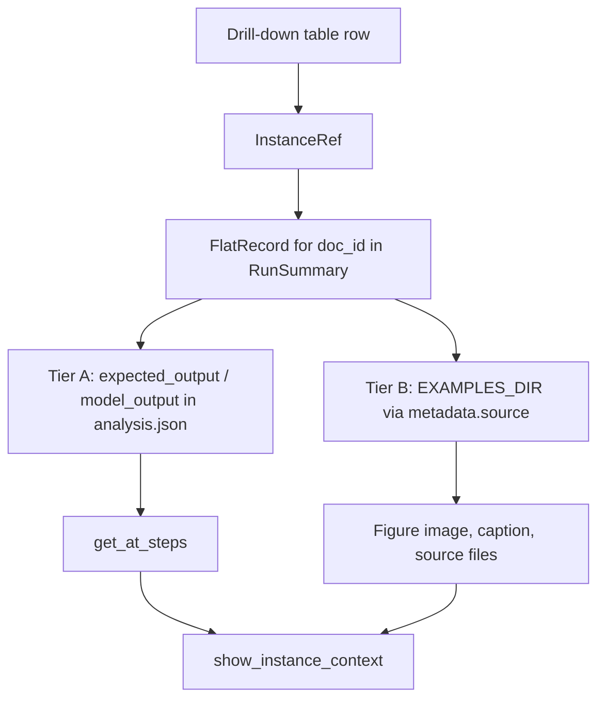

# Visualization plan — flat evaluation reporting

Plan for rewriting [`visualize.py`](../soda_mmqc/scripts/visualize.py) from scratch, inspired by [`notebooks/flat-eval-reporting-demo.ipynb`](../notebooks/flat-eval-reporting-demo.ipynb).

**Status:** Phases 1–2b implemented (`soda_mmqc/reporting/`, [`notebooks/reporting.ipynb`](../notebooks/reporting.ipynb)); plots (Phase 3) planned below.

**Primary usage:** Jupyter notebooks calling `soda_mmqc.reporting` (plots + interactive tables). A CLI is **out of scope for early phases** — add last if batch HTML export is still wanted.

**Related:**

- Normative scoring contract: [evaluation-scoring.md](evaluation-scoring.md)
- Run pipeline output: [`run.py`](../soda_mmqc/scripts/run.py) → `analysis.json`
- Phase 6 integration: [evaluation-implementation-plan.md](evaluation-implementation-plan.md)

---

## Context

### What the old `visualize.py` assumes

The current script targets the **hierarchical `JSONEvaluator`** output:

- Nested `element_scores`, recursive aggregation levels
- Multiple string metrics (`perfect_match`, `semantic_similarity`, …)
- Pooled `score` / precision / recall / F1 across fields
- `all_fields_aggregated` as a first-class “field”

That format is obsolete. `JSONEvaluator` has been removed; `run.py` now writes **flat** `FlatEvaluator` results.

### What `analysis.json` looks like now

```text
{ prompt_key: { "flat": [
    { doc_id, expected_output, model_output, metadata,
      analysis: { instances, by_list, by_property } }
] } }
```

- One metric bundle per prompt (`"flat"` key) — per-field `string_compare` and thresholds live in `eval-manifest.json`.
- Per-doc records: one gold/pred pair per benchmark example (figure, document slice, …).

### What the demo notebook already proves

[`flat-eval-reporting-demo.ipynb`](../notebooks/flat-eval-reporting-demo.ipynb) shows the target reporting model:

| Layer | Source | Chart |
|-------|--------|-------|
| **S** | `by_list[list_key].row_counts` | Structural row outcomes (`correct_row`, `missing_row`, `spurious_row`) |
| **1** | `by_property[*].layer1_counts` | Applicability per leaf property |
| **2** | `by_property[*].layer2_counts` | Matching per leaf property; split by `matching_metric` |

**Normative rule** ([evaluation-scoring.md](evaluation-scoring.md)): never pool counts or means across different leaf properties. Charts use **field tail** on the x-axis (`micrograph`, `panel_label`, …), one bar group per property.

---

## Design goals

1. **Notebook-first API** — load runs, aggregate, plot, and inspect tables from a notebook; charts via Plotly `.show()`, tables via an interactive DataFrame widget (see [Drill-down tables](#drill-down-tables-first-class)).
2. **One check, three layers** — structural (S), applicability (1), matching (2).
3. **Two comparison modes** (one per figure; not mixed):
   - **Prompt contrast** — same model, same check, multiple prompts.
   - **Model contrast** — same prompt (normalized), same check, multiple models.
4. **Per-property reporting** — every Layer 1/2 chart is indexed by `leaf_property` (displayed as field tail); no “all fields aggregated” bar.
5. **Multi-example runs** — sum layer counts *within* each property across `doc_id`s; Layer S `row_counts` summed per predictive list key; **per-doc and per-instance drill-down** via searchable tables.
6. **Collated + flat checks** — works whether `by_list` has `outputs` or `papers.figures.outputs`; list keys come from data, not hard-coded.

---

## Proposed module layout

Extract notebook logic into **`soda_mmqc/reporting/`** — importable from analysis notebooks (extend [`flat-eval-reporting-demo.ipynb`](../notebooks/flat-eval-reporting-demo.ipynb) or a new check-specific notebook). Legacy [`visualize.py`](../soda_mmqc/scripts/visualize.py) stays until replaced; **no new CLI in early phases**.

| Module | Responsibility |
|--------|----------------|
| `soda_mmqc/reporting/load.py` | Load `analysis.json`, normalize prompt labels; optional gold/pred payloads per record |
| `soda_mmqc/reporting/aggregate.py` | Fold per-doc `analysis` dicts into `RunSummary` |
| `soda_mmqc/reporting/tables.py` | Build Layer S / 1 / 2 summary DataFrames; instance-level drill-down tables |
| `soda_mmqc/reporting/navigate.py` | `get_at_steps(doc, steps)`; optional `path_string_to_steps()` for table `path` columns |
| `soda_mmqc/reporting/context.py` | `InstanceRef`, `ExampleContext`, `inspect_instance()`, `inspect_layer_s_row()` |
| `soda_mmqc/reporting/plots.py` | Plotly primitives + dashboard composer (`go.Figure` in → `.show()` in notebook) |
| `soda_mmqc/reporting/display.py` | Interactive table widgets + `show_instance_context()` |
| `soda_mmqc/reporting/styles.py` | Outcome orders, colour maps (from notebook) |
| `soda_mmqc/scripts/visualize.py` | **Phase 5 (optional):** thin CLI wrapping the same API for batch HTML export |

Keep plotting and table builders **pure** (DataFrame in → figure or DataFrame out). Only `display.py` depends on the notebook widget stack.

### Notebook workflow (target)

```python
from soda_mmqc.reporting.load import load_flat_runs
from soda_mmqc.reporting.aggregate import summarize_runs
from soda_mmqc.reporting.plots import build_dashboard, plot_comparison_layer1
from soda_mmqc.reporting.display import show_drilldown, show_issues_table, show_comparison_errors

# --- Prompt contrast (one model, several prompts) ---
runs = load_flat_runs(
    "fig-checklist",
    "micrograph-scale-bar",
    models="gpt-5-mini-2025-08-07",
    prompts=["prompt.1", "prompt.2", "prompt.3"],
)
summaries = summarize_runs(runs)  # keyed by (model, prompt)

s = summaries["gpt-5-mini-2025-08-07", "prompt.1"]
build_dashboard(s).show()
show_issues_table(s.layer_s_issues)
show_drilldown(s.instance_errors)

plot_comparison_layer1(summaries, compare="prompt", model="gpt-5-mini-2025-08-07").show()
show_comparison_errors(summaries, compare="prompt", model="gpt-5-mini-2025-08-07")

# --- Model contrast (one prompt, several models) ---
runs = load_flat_runs(
    "fig-checklist",
    "micrograph-scale-bar",
    models=["gpt-5-mini-2025-08-07", "gpt-5"],
    prompts="prompt.1",
)
summaries = summarize_runs(runs)

plot_comparison_layer1(summaries, compare="model", prompt="prompt.1").show()
show_comparison_errors(summaries, compare="model", prompt="prompt.1")

# --- Load everything available under the check ---
runs = load_flat_runs("fig-checklist", "micrograph-scale-bar")  # all models, all prompts
```

---

## Data loading & run identity

### Inputs

```text
EVALUATION_DIR / {checklist} / {check} / {model} / analysis.json
CHECKLIST_DIR    / {checklist} / {check} / eval-manifest.json   # Layer 2 split + field order
```

### `load_flat_runs(checklist, check, *, models=..., prompts=...)`

Loads one or more `analysis.json` files and returns a **`FlatRuns`** collection (list of **`FlatRun`** slices).

| Parameter | Type | Default | Behaviour |
|-----------|------|---------|-----------|
| `models` | `str \| Sequence[str] \| None` | `None` | Single model id, explicit list, or **`None` = discover all model subdirs** under `EVALUATION_DIR / checklist / check /` |
| `prompts` | `str \| Sequence[str] \| None` | `None` | Single normalized prompt, explicit list, or **`None` = all prompts** in each loaded `analysis.json` |

Each `(model, prompt)` pair in the cross-product (after filtering) yields one `FlatRun`. Missing paths are skipped with a logged warning (do not fail the whole load).

### `FlatRun` (one loaded slice)

| Field | Meaning |
|-------|---------|
| `checklist`, `check`, `model` | Path components |
| `prompt` | Normalized label (`prompt.1`, …) |
| `records` | List of per-doc flat records |
| `manifest` | `EvalManifest` for profile lookup |

### `FlatRecord` (one benchmark example in a run)

Today `load_flat_runs()` keeps `doc_id`, `metadata`, and `analysis` only. Each raw `analysis.json` entry also carries **`expected_output`** and **`model_output`** (full eval gold/pred JSON for that example). Example-context drill-down needs those payloads — see [Example context drill-down](#example-context-drill-down-on-demand).

| Field | Source | Used for |
|-------|--------|----------|
| `doc_id` | entry root | Row keys in tables; half of an `InstanceRef` |
| `metadata` | entry root | `source` path into `EXAMPLES_DIR`, `example_type`, model usage |
| `analysis` | entry root | `instances`, `by_list`, `by_property` (current reporting) |
| `expected_output` | entry root (lazy) | Gold subtree at `steps` |
| `model_output` | entry root (lazy) | Pred subtree at `steps` |

### `summarize_runs(runs) -> RunSummaries`

Indexable by **`(model, prompt)`** tuple (and helpers `.for_model(model)`, `.for_prompt(prompt)` for comparison plots). One **`RunSummary`** per `FlatRun`.

### Prompt normalization

Extend / reuse `normalize_prompt_name()` from the old script:

- `micrograph-scale-bar::local::prompt.1` → `prompt.1`
- Langfuse `::version::0` → `prompt.1`

### Comparison selectors

```text
PromptContrast(check, model, prompts=[...])
ModelContrast(check, prompt, models=[...])
```

Implemented via `load_flat_runs(..., models=..., prompts=...)` — both parameters accept a single value or a sequence; omit either to load all available. Not exposed as CLI flags in v1.

---

## Aggregation rules

**Across all leaf instances in the run, never across different leaf properties.** There is **no hierarchical roll-up** (no averaging per paper or per figure for summary charts). `doc_id` / ancestor context appear only on **drill-down rows**, not as an aggregation tier.

For each `FlatRun`, produce a **`RunSummary`** by pooling data from every per-doc record in that run.

### What “cross-doc” meant (resolved)

The old open question was **not** about grouping by paper or figure. It was only: when a run spans 14 benchmark figures, each with many panel rows, how do we collapse to **one bar per leaf property** for charts?

| Approach | Meaning |
|----------|---------|
| ~~Mean-of-doc-means~~ | Average each figure’s `mean_score`, then average those 14 numbers (each figure counts equally). **Not used.** |
| **Instance mean (chosen)** | Pool **every leaf instance** across all figures, then `mean(score)` — same rule as [`FlatEvaluator`](../soda_mmqc/core/evaluation.py) `_summarize_by_property` within a single `evaluate()` call. A figure with 10 panels contributes 10 instance scores; one with 2 panels contributes 2. |

Layer 1 / 2 **counts** use the same pooling: sum instance-level outcomes across all figures (still **within** each `leaf_property` only).

### Terminology: predictive list vs leaf property vs `by_list` key

These are **not** the same thing — the old open decision was unclear because it mixed them.

| Concept | What it is | Example (micrograph-scale-bar) | Example (collated demo) |
|---------|------------|-------------------------------|-------------------------|
| **Predictive list** | An **array of row objects** in the model schema, aligned with Hungarian matching (`list_alignment` in manifest). Rows are containers for fields. | `outputs[]` | `outputs[]` (same model schema) |
| **Leaf property** | A **field inside a row** (or a root scalar / primitive array). Scored in `by_property`. | `outputs[].micrograph`, `outputs[].panel_label` | `papers[].figures[].outputs[].is_micrograph` (eval paths after collation) |
| **`by_list` key** | Top-level key in `analysis["by_list"]` for **Layer S** row-alignment stats. Names the predictive array at its **eval document path** (dots, no `[]`). | `"outputs"` | `"papers.figures.outputs"` |
| **Structural list** | Collation wrapper arrays (`papers[]`, `figures[]`) joined positionally — **no** Layer S, **no** `by_list` entry. | N/A (flat gold/pred) | `papers[]`, `figures[]` |

Layer **S** answers: “Did we match the **rows** in the predictive array?” (missing panel, spurious panel, correct pairing). That is **orthogonal** to Layer 1/2 on **field values** inside aligned rows.

For almost all fig-checklist checks there is **one** predictive list — the model’s `outputs[]` — so `by_list` has **one key**. Collated eval documents only change the key string (prefix), not the number of predictive lists.

### Layer S (keys in `analysis["by_list"]`)

- Discover keys from merged `by_list` across the run (typically **one** key).
- **`row_counts`**: sum `correct_row` / `missing_row` / `spurious_row` per key across all docs.
- **`issues`**: concatenate missing/spurious row records; annotate with `doc_id` and ancestor context.
- If `by_list` is empty (no predictive array in schema) → omit the Layer S dashboard column.
- If multiple keys ever appear (schema with more than one `list_alignment` entry) → one Layer S bar chart per key, titled with that key. No need to pick a “primary” from the manifest.

### Layer 1 & 2 (per `leaf_property`)

- **`mean_score`**: mean of **all instance `score`s** for that property across the run (recompute from pooled `instances`, or equivalently instance-weighted combination of per-doc summaries).
- **`layer1_counts`**, **`layer2_counts`**: sum instance-level layer outcomes for that property across the run.

### Field ordering (x-axis)

1. Manifest `fields` key order (profiled leaves first).
2. Remaining keys in `by_property` (unprofiled), sorted.
3. Display label = `leaf_property_tail()` — e.g. `outputs[].micrograph` → `micrograph`.

### Layer 2 split

Use `manifest.profile_for(leaf_property).matching_metric`:

| Metric | Layer 2 outcomes | Chart |
|--------|------------------|-------|
| `binary_polarity` | TP, TN, FP, FN | Stacked bar per field |
| `graded_string` | match, mismatch | Stacked bar per field |

Unprofiled properties: show `mean_score` only (no Layer 1/2 stacks).

---

## Plotting primitives

Port from the demo notebook into `styles.py` + `plots.py`.

### Outcome orders

```text
LAYER_S_ORDER     = correct_row, missing_row, spurious_row
LAYER1_ORDER      = correct_NA, correct_applicable, withheld_applicable, spurious_applicable
LAYER2_BINARY     = TP, TN, FP, FN
LAYER2_GRADED     = match, mismatch
```

Distinct colour palettes per layer (notebook: `LAYER_S_COLORS`, `LAYER1_COLORS`, `LAYER2_BINARY_COLORS`, `LAYER2_GRADED_COLORS`).

### Core functions

| Function | Purpose |
|----------|---------|
| `plot_layer_s_bar(counts, *, title)` | Single-run structural outcomes |
| `plot_layer1_stacked(df, *, title)` | x = field tail, stack = Layer 1 outcomes |
| `plot_layer2_stacked(df, order, colors, *, title)` | x = field tail; binary or graded |
| `plot_mean_score_bars(df, *, title)` | Supplementary: per-property `mean_score` |
| `plot_comparison_layer1(runs, *, mode)` | Grouped/stacked: x = field, series = prompt or model |
| `plot_comparison_layer2_binary(...)` | Comparison for binary properties |
| `plot_comparison_layer2_graded(...)` | Comparison for graded properties |
| `build_dashboard(summary \| summaries, *, compare_mode)` | 4-column subplot (S, L1, L2 binary, L2 graded) |

### Single-run dashboard (4 columns)

Mirror the notebook:

1. **Layer S** — predictive list row counts
2. **Layer 1** — applicability by field
3. **Layer 2 binary** — TP/TN/FP/FN by field
4. **Layer 2 graded** — match/mismatch by field

One legend per Layer 1 / L2 subplot (not a single global legend).

### Comparison layout (multi run)

| Option | When | Layout |
|--------|------|--------|
| **B (default)** | Prompt or model contrast | Grouped stacked bars: x = field tail, colour = prompt/model, stack = outcome |
| **A** | Deep inspection | One 4-column dashboard per series, faceted row = prompt/model |

Option B answers: “Which prompt is best on `scale_bar_on_image`?” Option A mirrors the notebook per run.

---

## Drill-down tables (first-class)

Charts give the **aggregate picture**; drill-down tables are how we **find culprits** (which figure, which panel, which field). They are as important as the Layer S / 1 / 2 plots — not an afterthought.

### Table builders (`tables.py`)

Each function returns a **pandas `DataFrame`** (stable schema for tests and notebook display).

| Builder | Rows | Key columns |
|---------|------|-------------|
| `layer_s_issues_table` | Every missing / spurious predictive row | `doc_id`, `list_key`, `structural`, `location` (ancestor context), `gold_alignment`, `pred_alignment`, `context_path` |
| `layer1_instance_table` | Instances with non-`correct_NA` / non-`correct_applicable` layer 1 | `doc_id`, `path`, `leaf_property`, `field`, `layer1`, `exp_value`, `pred_value` |
| `layer2_instance_table` | Instances with layer-2 errors (FP, FN, mismatch) | `doc_id`, `path`, `leaf_property`, `field`, `layer2`, `score`, `exp_value`, `pred_value` |
| `per_doc_property_table` | One row per (doc, leaf property) | `doc_id`, `leaf_property`, `field`, `mean_score`, layer-1/2 dominant outcome |
| `worst_docs_table` | Docs ranked by error burden | `doc_id`, `layer_s_errors`, `layer1_errors`, `layer2_errors`, link columns from `metadata` |

**Filtering helpers** (same module): `filter_by_doc`, `filter_by_field`, `filter_by_layer_outcome` — return narrowed DataFrames before display.

Replace the old “worst items by pooled F1” workflow entirely with these layer-aware tables.

### Interactive display (`display.py`)

Notebook entry points wrap DataFrames in a **sortable, filterable, searchable** widget — not plain `display(df)` or static HTML.

**Recommended stack:** [`itables`](https://github.com/mwouts/itables) — renders pandas DataFrames with DataTables.js (column sort, global search, per-column filters, pagination). Fits Jupyter Lab/Notebook; minimal custom JS.

```python
from soda_mmqc.reporting.display import show_table

show_table(layer2_instance_table(summary), caption="Layer 2 errors")
```

**`show_table(df, *, caption, default_sort, column_filters)`** behaviour:

- Sort on click (all columns)
- Search box across all columns
- Per-column text/select filters where useful (e.g. `layer2`, `field`, `doc_id`)
- Sensible default sort (e.g. `doc_id`, then `path`)
- Optional export: copy visible rows / download CSV from widget

**Higher-level helpers** (thin wrappers):

| Function | Shows |
|----------|--------|
| `show_issues_table(summary)` | Layer S missing + spurious |
| `show_layer2_errors(summary, *, field=None, doc_id=None)` | Filtered layer-2 culprits |
| `show_comparison_errors(summaries, compare="prompt")` | Side-by-side or long-form errors across prompts/models |

**Fallback:** if `itables` is not installed, log a warning and fall back to `IPython.display.display(df)` with a note to `pip install itables`. Add `itables` to `requirements.txt` when implementing.

### Notebook layout pattern

For each check under review:

1. **Dashboard figure** — Layer S + Layer 1 + Layer 2 (4 columns)
2. **Issue tables** — Layer S missing/spurious (interactive)
3. **Layer 2 culprits** — full instance table, pre-sorted by `doc_id` / `field`
4. **Comparison block** (optional) — overlay chart + long-form error table filtered to differing fields
5. **Example context** (on demand) — after picking a row, inspect gold/pred (and figure image when available); see [Example context drill-down](#example-context-drill-down-on-demand)

Instance tables stay **narrow** (`doc_id`, `path`, `field`, layer outcomes, `exp_value` / `pred_value`). Full JSON, panel rows, captions, and images are **not** inlined per row.

---

## Example context drill-down (on-demand)

### Problem

Drill-down tables answer *where* something went wrong (`doc_id`, `outputs[7].scale_bar_on_image`, layer outcome). They do not answer *what the example looked like* — the panel row, the figure image, the caption, or the full gold vs pred subtree.

We need a second step: the user picks a `doc_id` and navigates into gold/pred with an explicit **list of keys and indices** — no string path parser required.

```python
doc_id = "10.1038_s44318-026-00715-1"
steps = ["outputs", 0]                              # row-level (full panel object)
steps = ["outputs", 0, "scale_bar_on_image"]        # leaf-level (one field)
steps = ["papers", 0, "figures", 2, "outputs", 3]   # collated row
```

Drill-down tables still expose human-readable `path` strings (e.g. `outputs[7].scale_bar_on_image`) for search and sorting. The inspect API takes **`steps`**, which the user builds from the table row by hand (or via an optional one-line helper — not a general parser).

### Locator model

**`PathStep`** = `str` (object key) or `int` (list index).

| Navigation target | Example `steps` | Table `path` column (display only) |
|-------------------|-----------------|-------------------------------------|
| Leaf field | `["outputs", 7, "scale_bar_on_image"]` | `outputs[7].scale_bar_on_image` |
| Full panel row | `["outputs", 7]` | *(derive from leaf or indices)* |
| Whole predictive list | `["outputs"]` | `outputs` |
| Collated row | `["papers", 0, "figures", 2, "outputs", 3]` | `papers[0].figures[2].outputs[3].…` |

Proposed **`InstanceRef`** (immutable):

```python
@dataclass(frozen=True)
class InstanceRef:
    doc_id: str
    steps: tuple[PathStep, ...]    # keys + indices into eval JSON root
```

Layer S rows (`gold_index`, `pred_index`, `context_path`) may use a separate helper that **constructs `steps` from indices** already in the analysis row — still a list, not parsed from a string.

### Data sources (two tiers)



| Tier | Source | What it provides | When required |
|------|--------|------------------|---------------|
| **A — Inline JSON** | `expected_output`, `model_output` on each `analysis.json` flat entry | Gold/pred values and row objects at `steps` | Always (value drill-down) |
| **B — Example assets** | `metadata.source` → `EXAMPLES_DIR / {source}` via `EXAMPLE_FACTORY` | Figure image, caption, tables (`FigureExample`); whole-doc content for doc-checklist | Visual context; optional if JSON alone suffices |

Tier A is already written by `run.py` but **dropped** by `load_flat_runs()` today. Tier B is not duplicated in `analysis.json` — must resolve through `metadata.source` (e.g. `10.1038_s44318-026-00715-1/content/1`).

**Lazy loading (resolved):** `analysis.json` entries are large. Extend `FlatRecord` with optional payloads; default `load_flat_runs(..., include_payloads=False)` for charts/tables. `inspect_instance()` loads gold/pred for that `doc_id` on first use (`include_payloads=True` on demand, or `load_record_payload(record)`).

### Path navigation (simple walk — not a parser)

No bracket-string parser. The caller supplies `steps: Sequence[str | int]`; the library walks the JSON:

```python
def get_at_steps(doc: Mapping[str, Any], steps: Sequence[str | int]) -> Any:
    current: Any = doc
    for step in steps:
        if isinstance(step, int):
            current = current[step]
        else:
            current = current[step]
    return current
```

(~10 lines with type checks and clear `KeyError` / `IndexError` messages naming `doc_id` and the failing step.)

Optional convenience only — **not** part of the core contract:

- `path_string_to_steps("outputs[7].scale_bar_on_image")` for users who copied the table `path` column and want a shortcut. Skip if it adds complexity; manual `["outputs", 7, "scale_bar_on_image"]` is always valid.

**Edge cases:**

| Case | Behaviour |
|------|-----------|
| `missing_row` (Layer S) | Build gold `steps` with `gold_index`; pred side absent — show gold only |
| `spurious_row` | Build pred `steps` with `pred_index`; gold absent — show pred only |
| `withheld_applicable` | `get_at_steps` on gold; pred missing at leaf — show empty pred |
| Step not found | Error names `doc_id`, `steps`, and which side (gold/pred) failed |

### Display API (notebook)

Pure builders in `context.py`; rendering in `display.py`.

```python
@dataclass
class ExampleContext:
    ref: InstanceRef
    exp_value: Any
    pred_value: Any
    exp_row: dict[str, Any] | None      # parent row when path is a leaf
    pred_row: dict[str, Any] | None
    exp_subtree: Any                    # value at path (scalar, row, or list)
    pred_subtree: Any
    metadata: dict[str, Any]
    example_preview: ExamplePreview | None   # image path, caption, example_type

def inspect_instance(
    summary: RunSummary,
    *,
    doc_id: str,
    steps: Sequence[str | int],
    include_example_assets: bool = True,
) -> ExampleContext: ...

def show_instance_context(ctx: ExampleContext) -> None: ...
```

**`show_instance_context`** layout (v1, no custom itables JS):

1. Header — `doc_id`, `steps`, model/prompt from summary
2. **Figure preview** (if `example_type == "figure"` and image exists) — caption + image via `IPython.display`
3. **Side-by-side** — gold vs pred for the resolved subtree (pretty JSON for objects; scalars inline)
4. **Row context** — when inspecting a leaf, show the parent row dict on both sides
5. **Eval snippet** — optional collapsed full `expected_output` / `model_output`

Workflow in [`reporting.ipynb`](../notebooks/reporting.ipynb):

```python
row = culprits.query("field == 'scale_bar_on_image'").iloc[0]
# Table path "outputs[3].scale_bar_on_image" → user supplies steps explicitly:
ctx = inspect_instance(
    summary_p2,
    doc_id=row["doc_id"],
    steps=["outputs", 3, "scale_bar_on_image"],
)
show_instance_context(ctx)
```

### itables integration (later)

v1: **explicit** `inspect_instance()` after picking `doc_id` from a table row and supplying `steps` (indices/keys read from the row's `path` column or from `gold_index` / `pred_index`).

v2 options (defer):

- `ipywidgets` “Inspect” button driven by selected row
- Custom itables column with `javascript` callback (heavier)
- Precomputed `instance_key` column (`doc_id|path`) for search → `inspect_instance(**parse_key(key))`

Do **not** embed images or full JSON in table rows.

### Check-type differences

| Checklist type | `metadata.source` | Preview focus |
|----------------|-------------------|---------------|
| **fig-checklist** | `doc_id/content/{figure_id}` | Image + caption + panel row JSON |
| **doc-checklist** | document slice path | Caption / section text; usually no figure image |

`ExamplePreview` should branch on `metadata.example_type` (`figure` vs future types).

### Implementation phase — **2b Example context** (after Phase 2, before or parallel to Phase 3 plots)

| Step | Work |
|------|------|
| 1 | Extend `FlatRecord` + `load_flat_runs(..., include_payloads=)` |
| 2 | `navigate.py`: `get_at_steps` (+ optional `path_string_to_steps` helper) |
| 3 | `context.py`: `InstanceRef`, `ExampleContext`, `inspect_instance`, Layer S variant |
| 4 | `display.py`: `show_instance_context` (JSON + figure preview) |
| 5 | Wire [`reporting.ipynb`](../notebooks/reporting.ipynb) — inspect a known prompt.2 scale-bar row |
| 6 | Tests: `get_at_steps` fixtures; `inspect_instance` on micrograph-scale-bar real run; missing/spurious asymmetry |

Plots (Phase 3) do not depend on this phase.

---

## What to remove from old `visualize.py`

- `data_to_tabular()` and hierarchical recursion
- `metric` dimension and `similarity_dict` per-field metrics
- `precision` / `recall` / `f1_score` unless recomputed **per property** from `layer2_counts`
- `aggregation_level` / `all_fields_aggregated`
- Checklist-wide scatter of pooled scores (out of scope for v1 — single-check reporting only)

---

## Implementation phases

### Phase 1 — Core library (load + aggregate + tables) ✅ *complete*

- `soda_mmqc/reporting/load.py`, `aggregate.py`, `tables.py`, `styles.py`
- `RunSummary` / `RunSummaries`; `aggregate_run`, `summarize_runs`, `load_flat_runs`
- Drill-down table builders (instance-level, not just rollups)
- Tests: `tests/test_reporting_phase1.py` (micrograph-scale-bar + collated demo)

### Phase 2 — Interactive drill-down (`display.py`) ✅ *complete*

- `show_table()` with itables; `show_issues_table`, `show_layer1_errors`, `show_layer2_errors`, `show_comparison_errors`
- `instance_culprits_table` for combined Layer 1 + Layer 2 drill-down (prompt.2 scale-bar story)
- `itables` in `pyproject.toml`
- Smoke notebook: [`notebooks/reporting.ipynb`](../notebooks/reporting.ipynb)

### Phase 2b — Example context (on-demand) ✅ *complete*

- `navigate.py` + `context.py`; `load.py` lazy gold/pred via `ensure_record_payloads()` / `load_record_payloads()`
- `inspect_instance(doc_id, steps)` / `inspect_layer_s_row()` / `show_instance_context()`
- Tests: `tests/test_reporting_context.py`
- [`reporting.ipynb`](../notebooks/reporting.ipynb) — inspect workflow after table filter

### Phase 3 — Plots (`plots.py`)

- Port notebook plotting primitives + `build_dashboard(RunSummary)`
- Comparison plots (`plot_comparison_layer1`, layer-2 variants)
- Extend [`flat-eval-reporting-demo.ipynb`](../notebooks/flat-eval-reporting-demo.ipynb) or add `notebooks/flat-eval-reporting-micrograph.ipynb` using the library end-to-end

### Phase 4 — Comparison mode in notebooks

- `load_flat_runs()` for multiple prompts or models
- `show_comparison_errors()` long-form table + overlay charts
- Primary cases on `micrograph-scale-bar`:
  - **Prompt contrast:** `gpt-5-mini-2025-08-07`, prompts 1–3 (prompt.2 scale-bar weakness)
  - **Model contrast:** `prompt.1`, models `gpt-5-mini-2025-08-07` vs `gpt-5`

### Phase 5 (optional) — CLI & batch export

- Thin wrapper in `visualize.py` (or new script) calling the same API
- Write Plotly HTML + static table exports to `PLOTS_DIR` if still needed
- Supersede [`analysis_json_to_html.py`](../soda_mmqc/scripts/analysis_json_to_html.py) only if notebooks + itables cover the workflow

---

## Test plan

| Test | Assert |
|------|--------|
| Load micrograph `analysis.json` | 2 models × 3 prompts × 14 records each |
| Model contrast load | `gpt-5` + `gpt-5-mini-2025-08-07`, `prompt.1` → two `RunSummary` entries |
| Aggregate `prompt.1` | Layer 1/2 totals match manual per-doc sum |
| No cross-property pooling | Chart input is per-property tables, not `aggregate_layer1_counts()` |
| `split_layer2_by_metric` | `micrograph` → binary; `from_the_caption` → graded |
| `layer2_instance_table` | Known prompt.2 errors appear with correct `doc_id`, `path`, `layer2` |
| `layer_s_issues_table` | Collated demo: missing/spurious rows include `location` text |
| Table column schema | Golden snapshot of column names + dtypes per builder |
| `show_table` smoke | Returns without error when itables installed (optional marker) |
| Comparison plot data | N series × M profiled fields on x-axis |
| `get_at_steps` | `["outputs", 2, "micrograph"]`, collated `["papers", 0, "figures", 1, "outputs", 3, "label"]` |
| `inspect_instance` | Known prompt.2 row → correct `exp_value` / `pred_value` at leaf path |
| `show_instance_context` | Figure example loads image from `metadata.source`; missing_row shows gold only |
| `load_flat_runs(include_payloads=True)` | `FlatRecord` carries `expected_output` / `model_output` |

---

## First validation target

Real `analysis.json` runs on disk for **`micrograph-scale-bar`**:

| | |
|--|--|
| **Check** | `micrograph-scale-bar` |
| **Models** | `gpt-5-mini-2025-08-07`, `gpt-5` |
| **Prompts** | 1–3 (local `prompt.1` … `prompt.3`) |

First end-to-end notebook validation exercises **both comparison modes**:

### A — Prompt contrast (one model)

```python
runs = load_flat_runs(
    "fig-checklist", "micrograph-scale-bar",
    models="gpt-5-mini-2025-08-07",
    prompts=["prompt.1", "prompt.2", "prompt.3"],
)
```

**Expected story** (no pooling across properties):

- **prompt.1 / 3** — high binary scores on scale-bar fields
- **prompt.2** — `scale_bar_*` properties show heavy `spurious_applicable` (Layer 1) and low per-property means
- Drill-down tables surface specific `doc_id` / panel paths for prompt.2 culprits

### B — Model contrast (one prompt)

```python
runs = load_flat_runs(
    "fig-checklist", "micrograph-scale-bar",
    models=["gpt-5-mini-2025-08-07", "gpt-5"],
    prompts="prompt.1",
)
```

**Expected story:**

- Overlay Layer 1/2 charts and `show_comparison_errors()` for `prompt.1` across both models
- Differences in per-property instance counts and layer-2 outcomes visible field-by-field (not pooled)
- Layer S `outputs` row counts comparable across models on the same prompt

### Shared checks (both A and B)

- Layer S — mostly `correct_row` across 14 figures; missing/spurious rows in searchable issue tables when present
- `itables` drill-down: filter by `field`, `layer2`, or `doc_id` to inspect culprits

---

## Open decisions

Review before implementation:

| # | Question | Recommendation |
|---|----------|----------------|
| ~~1~~ | ~~Cross-doc `mean_score`~~ | **Resolved:** instance mean per `leaf_property` (pool all leaf instances; no per-figure tier). See [Aggregation rules](#aggregation-rules). |
| ~~2~~ | ~~Multiple predictive lists / `by_list` keys~~ | **Resolved:** Layer S uses keys from `analysis["by_list"]` (the aligned **row array**, not leaf fields). Fig-checklist checks typically have one key (`outputs` or `papers.figures.outputs`). See [Terminology](#terminology-predictive-list-vs-leaf-property-vs-by_list-key). |
| ~~3~~ | ~~Checklist-level overview in v1?~~ | **Resolved: no.** Single-check reporting only for v1; no checklist-wide summary or index page. |
| ~~4~~ | ~~Package name~~ | **Resolved:** `soda_mmqc/reporting/` |
| ~~5~~ | ~~Interactive table widget library?~~ | **Resolved:** [`itables`](https://github.com/mwouts/itables) (DataTables.js); fallback to plain `display(df)` if not installed |
| 6 | CLI in v1? | **No** — notebook API first; CLI in Phase 5 only if needed |
| ~~7~~ | ~~Example content in drill-down tables?~~ | **Resolved: no.** Instance rows stay narrow. Content is unpredictable (text-only, text + images, images + data later) and too large for table cells. On-demand `inspect_instance(doc_id, steps)` (Phase 2b). Tier A: gold/pred JSON; Tier B: figure assets via `metadata.source` |
| ~~8~~ | ~~Load gold/pred on every `load_flat_runs()`?~~ | **Resolved: lazy by default.** `include_payloads=False` for aggregates; load payloads when inspecting |

---

## Appendix: notebook functions to port

From `flat-eval-reporting-demo.ipynb`:

- `leaf_property_tail(leaf_property) -> str`
- `counts_to_frame(counts, order, label) -> pd.DataFrame`
- `plot_outcome_bar(counts, order, title, color_map) -> go.Figure`
- `layer_counts_by_property(result, order, attr) -> pd.DataFrame`
- `split_layer2_by_metric(result, manifest) -> (binary_df, graded_df)`
- `plot_layer2_stacked(df, order, title, color_map) -> go.Figure`
- `issue_table(issue_rows, side, alignment_col) -> pd.DataFrame`
- 4-column `make_subplots` dashboard composer

These operate on `EvaluationResult` today; the library version should accept **`RunSummary`** (rollups for charts) plus raw per-doc `instances` / `by_list` rows for drill-down table builders.

**Implemented in `soda_mmqc/reporting/`:**

- Instance-level tables from `analysis["instances"]` filtered by `layer1` / `layer2` (+ `instance_culprits_table`)
- `display.show_table()` wrapping itables for notebook inspection
- [`notebooks/reporting.ipynb`](../notebooks/reporting.ipynb) smoke test on micrograph-scale-bar

**Phase 2b (example context):**

- `InstanceRef(doc_id, steps)` + `get_at_steps()` (key/index list walk)
- `inspect_instance()` / `show_instance_context()` — gold/pred subtree + optional figure preview
- Lazy load of `expected_output` / `model_output` from `analysis.json`
